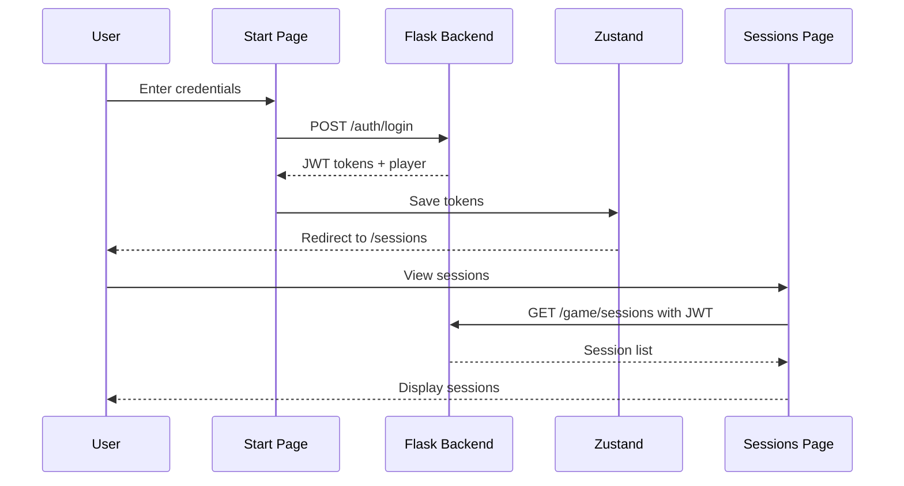

# Coup Game Frontend MVP

A focused 3-page MVP to get a functional frontend connected to the Flask backend.

## Tech Stack

| Layer | Technology | Why |

|-------|------------|-----|

| Framework | **Next.js 14 + App Router** | File-based routing with `[id]` dynamic segments |

| Language | **TypeScript** | Type safety, matches backend model structure |

| Styling | **Tailwind CSS** | Rapid development, utility-first |

| State | **Zustand** | Simple auth/user state management |

| Logging | **loglevel** | Environment-based log levels (like Python logging) |

| Validation | **Zod** | Runtime schema validation (like Pydantic) |

| Data Fetching | **React Query** | Caching, infinite scroll, mutations |

| Animation | **Framer Motion** | Programmable animations, gestures |

| Animation | **lottie-react** | After Effects / LottieFiles animations |

| Audio | **use-sound** | Sound effects and music hooks |

| Game Engine | **Unity WebGL** | 3D virtual world (separate project) |

| Real-time | **Socket.io** | Multiplayer sync (future) |

## MVP Scope: 3 Functional Pages

| Page | Route | Features |

|------|-------|----------|

| **Start Page** | `/` | Login form, OAuth buttons (Discord/Slack/Google), register link |

| **Profile Page** | `/profile/[playerId]` | Display player info, platforms, current session |

| **Sessions Page** | `/sessions` | List active game sessions, join button, create session |

## Project Structure

```
game_server/frontend/
├── app/
│   ├── layout.tsx              # Root layout + providers
│   ├── page.tsx                # Start Page (login)
│   ├── globals.css             # Tailwind imports
│   │
│   ├── profile/
│   │   └── [playerId]/
│   │       └── page.tsx        # Profile Page → /profile/player1
│   │
│   └── sessions/
│       ├── page.tsx            # Sessions List → /sessions
│       └── loading.tsx         # Loading skeleton
│
├── components/
│   ├── ui/
│   │   ├── Button.tsx          # Reusable button
│   │   ├── Input.tsx           # Form input
│   │   ├── Card.tsx            # Card container
│   │   └── Skeleton.tsx        # Loading placeholder
│   ├── auth/
│   │   ├── LoginForm.tsx       # Username/password form
│   │   └── OAuthButtons.tsx    # Discord/Slack/Google (lazy loaded)
│   └── sessions/
│       └── SessionCard.tsx     # Single session display
│
├── lib/
│   ├── api/
│   │   ├── client.ts           # Fetch wrapper with JWT
│   │   ├── auth.ts             # Login, register, refresh
│   │   └── sessions.ts         # Get sessions, join session
│   ├── config.ts               # Runtime app config (feature flags, timeouts)
│   ├── constants.ts            # Static values (routes, enums)
│   └── logger.ts               # loglevel with env-based levels
│
├── stores/
│   └── authStore.ts            # Zustand: tokens, user, login/logout
│
├── hooks/
│   ├── useIntersectionObserver.ts  # Infinite scroll trigger
│   ├── useGameSounds.ts            # Sound effects hook
│   └── useSocket.ts                # WebSocket connection hook (future)
│
├── types/
│   ├── index.ts                # Re-exports all types
│   ├── auth.ts                 # Auth types + Zod schemas
│   ├── player.ts               # Player types + Zod schemas
│   └── session.ts              # Session types + Zod schemas
│
├── public/                     # Static assets (served at /)
│   ├── images/
│   │   ├── logo.png            # → /images/logo.png
│   │   ├── cards/              # Card artwork
│   │   │   ├── duke.png
│   │   │   ├── assassin.png
│   │   │   ├── captain.png
│   │   │   ├── ambassador.png
│   │   │   ├── contessa.png
│   │   │   └── card-back.png
│   │   └── backgrounds/
│   ├── icons/
│   │   ├── favicon.ico         # Browser tab icon
│   │   ├── discord.svg         # OAuth provider icons
│   │   ├── slack.svg
│   │   └── google.svg
│   ├── audio/
│   │   ├── music/
│   │   │   ├── lobby.mp3       # Background music
│   │   │   └── game.mp3
│   │   └── sfx/
│   │       ├── coin.mp3        # Coin collect sound
│   │       ├── card-flip.mp3   # Card reveal
│   │       ├── challenge.mp3   # Challenge action
│   │       ├── success.mp3     # Action succeeded
│   │       └── fail.mp3        # Action failed
│   ├── animations/             # Lottie JSON files (from After Effects / LottieFiles)
│   │   ├── coin-collect.json   # Coin reward animation
│   │   ├── card-reveal.json    # Card flip effect
│   │   ├── victory.json        # Win celebration
│   │   └── loading.json        # Branded loading spinner
│   └── fonts/                  # Custom fonts (if not using Google Fonts)
│
├── middleware.ts               # Protect /profile, /sessions
├── package.json                # npm run local/dev/qa/prod scripts
├── package-lock.json           # Lock file (auto-generated)
├── .env.local                  # Local environment (localhost:4000)
├── .env.development            # Dev environment
├── .env.qa                     # QA environment
├── .env.production             # Production environment
├── next.config.js
├── tailwind.config.ts
├── tsconfig.json
└── README.md                   # Project documentation
```

## Page Details

### 1. Start Page (`/`)

```typescript
// app/page.tsx - Login page
'use client';
export default function StartPage() {
  return (
    <main className="min-h-screen flex items-center justify-center">
      <div className="w-full max-w-md space-y-6">
        <h1>Welcome to Coup</h1>
        <LoginForm />
        <OAuthButtons />
        <Link href="/register">Create account</Link>
      </div>
    </main>
  );
}
```

**Connects to backend:**

- `POST /auth/login` - Username/password login
- `GET /auth/oauth/discord` - OAuth redirect
- `GET /auth/oauth/slack` - OAuth redirect
- `GET /auth/oauth/google` - OAuth redirect

### 2. Profile Page (`/profile/[playerId]`)

```typescript
// app/profile/[playerId]/page.tsx
export default async function ProfilePage({ params }: { params: { playerId: string } }) {
  // Fetch player data server-side
  const player = await getPlayer(params.playerId);
  
  return (
    <main>
      <h1>{player.display_name}</h1>
      <p>Platforms: {player.social_media_platforms.join(', ')}</p>
      <p>Current Session: {player.session_id || 'None'}</p>
    </main>
  );
}
```

**Connects to backend:**

- `GET /players/{display_name}` - Fetch player profile

### 3. Sessions Page (`/sessions`)

```typescript
// app/sessions/page.tsx
'use client';
export default function SessionsPage() {
  const { data: sessions } = useQuery(['sessions'], getSessions);
  
  return (
    <main>
      <h1>Game Sessions</h1>
      <div className="grid gap-4">
        {sessions?.map(session => (
          <SessionCard key={session.session_id} session={session} />
        ))}
      </div>
    </main>
  );
}
```

**Connects to backend:**

- `GET /game/sessions` - List all sessions
- `POST /game/sessions/{id}/join` - Join a session

## API Client Pattern

```typescript
// lib/api/client.ts
const API_BASE = process.env.NEXT_PUBLIC_API_URL || 'http://localhost:4000';

export async function apiClient<T>(
  endpoint: string,
  options: RequestInit = {}
): Promise<T> {
  const token = useAuthStore.getState().accessToken;
  
  const res = await fetch(`${API_BASE}${endpoint}`, {
    ...options,
    headers: {
      'Content-Type': 'application/json',
      ...(token && { Authorization: `Bearer ${token}` }),
      ...options.headers,
    },
  });
  
  if (!res.ok) throw new Error(await res.text());
  return res.json();
}
```

## Lottie Animations (Designer-Made)

For complex animations from After Effects or LottieFiles:

```typescript
// Install: npm install lottie-react

import Lottie from 'lottie-react';
import victoryAnimation from '@/public/animations/victory.json';

export function VictoryCelebration() {
  return (
    <Lottie 
      animationData={victoryAnimation}
      loop={false}
      style={{ width: 200, height: 200 }}
    />
  );
}
```

### Controlled Playback

```typescript
import Lottie from 'lottie-react';
import { useRef } from 'react';
import coinAnimation from '@/public/animations/coin-collect.json';

export function CoinReward({ onComplete }: { onComplete: () => void }) {
  const lottieRef = useRef(null);

  return (
    <Lottie
      lottieRef={lottieRef}
      animationData={coinAnimation}
      loop={false}
      autoplay={true}
      onComplete={onComplete}  // Callback when animation ends
    />
  );
}
```

### Where to Get Lottie Files

| Source | Notes |

|--------|-------|

| **LottieFiles.com** | Huge free library, search "coin", "card", etc. |

| **After Effects** | Your animator friends export via Bodymovin plugin |

| **Figma** | LottieFiles plugin exports animations |

## Programmable Animations (Framer Motion)

Framer Motion lets you animate React components declaratively:

### Basic Animation

```typescript
import { motion } from 'framer-motion';

// Animate on mount
<motion.div
  initial={{ opacity: 0, y: 20 }}    // Start state
  animate={{ opacity: 1, y: 0 }}      // End state
  transition={{ duration: 0.3 }}      // Timing
>
  <SessionCard session={session} />
</motion.div>
```

### Card Flip Animation

```typescript
// components/game/CardFlip.tsx
'use client';
import { motion } from 'framer-motion';
import { useState } from 'react';

export function CardFlip({ card }: { card: string }) {
  const [isFlipped, setIsFlipped] = useState(false);

  return (
    <motion.div
      className="relative w-24 h-36 cursor-pointer"
      onClick={() => setIsFlipped(!isFlipped)}
      animate={{ rotateY: isFlipped ? 180 : 0 }}
      transition={{ duration: 0.6 }}
      style={{ transformStyle: 'preserve-3d' }}
    >
      {/* Front - card back */}
      <motion.img
        src="/images/cards/card-back.png"
        className="absolute w-full h-full backface-hidden"
      />
      {/* Back - card face */}
      <motion.img
        src={`/images/cards/${card}.png`}
        className="absolute w-full h-full backface-hidden"
        style={{ rotateY: 180 }}
      />
    </motion.div>
  );
}
```

### Staggered List Animation

```typescript
// Animate session cards appearing one by one
<motion.div className="grid gap-4">
  {sessions.map((session, i) => (
    <motion.div
      key={session.session_id}
      initial={{ opacity: 0, x: -20 }}
      animate={{ opacity: 1, x: 0 }}
      transition={{ delay: i * 0.1 }}  // Stagger by 100ms
    >
      <SessionCard session={session} />
    </motion.div>
  ))}
</motion.div>
```

## Audio (Sound Effects & Music)

Using the `use-sound` library for game audio:

### Sound Effects

```typescript
// hooks/useGameSounds.ts
import useSound from 'use-sound';

export function useGameSounds() {
  const [playCoin] = useSound('/audio/sfx/coin.mp3');
  const [playCardFlip] = useSound('/audio/sfx/card-flip.mp3');
  const [playChallenge] = useSound('/audio/sfx/challenge.mp3', { volume: 0.5 });
  const [playSuccess] = useSound('/audio/sfx/success.mp3');
  const [playFail] = useSound('/audio/sfx/fail.mp3');

  return { playCoin, playCardFlip, playChallenge, playSuccess, playFail };
}
```

### Usage in Components

```typescript
// components/game/ActionPanel.tsx
'use client';
import { useGameSounds } from '@/hooks/useGameSounds';

export function ActionPanel() {
  const { playCoin, playChallenge } = useGameSounds();

  const handleIncome = async () => {
    playCoin();  // Play sound immediately
    await submitAction('income');
  };

  const handleChallenge = async () => {
    playChallenge();
    await submitAction('challenge');
  };

  return (
    <div>
      <button onClick={handleIncome}>Take Income</button>
      <button onClick={handleChallenge}>Challenge!</button>
    </div>
  );
}
```

### Background Music

```typescript
// components/layout/BackgroundMusic.tsx
'use client';
import useSound from 'use-sound';
import { useState } from 'react';

export function BackgroundMusic({ track }: { track: 'lobby' | 'game' }) {
  const [isPlaying, setIsPlaying] = useState(false);
  const [play, { stop }] = useSound(`/audio/music/${track}.mp3`, {
    volume: 0.3,
    loop: true,
  });

  const toggle = () => {
    if (isPlaying) {
      stop();
    } else {
      play();
    }
    setIsPlaying(!isPlaying);
  };

  return (
    <button onClick={toggle}>
      {isPlaying ? '🔊 Music On' : '🔇 Music Off'}
    </button>
  );
}
```

## Infinite Scroll (Sessions Page)

Load sessions incrementally as the user scrolls — a common pattern in production apps.

### The Hook: `useIntersectionObserver`

```typescript
// hooks/useIntersectionObserver.ts
import { useEffect, useRef, useState } from 'react';

export function useIntersectionObserver() {
  const [isVisible, setIsVisible] = useState(false);
  const ref = useRef<HTMLDivElement>(null);

  useEffect(() => {
    const observer = new IntersectionObserver(
      ([entry]) => setIsVisible(entry.isIntersecting),
      { threshold: 0.1 }
    );
    
    if (ref.current) observer.observe(ref.current);
    return () => observer.disconnect();
  }, []);

  return { ref, isVisible };
}
```

### Sessions Page with Infinite Scroll

```typescript
// app/sessions/page.tsx
'use client';
import { useInfiniteQuery } from '@tanstack/react-query';
import { useIntersectionObserver } from '@/hooks/useIntersectionObserver';
import { getSessionsPaginated } from '@/lib/api/sessions';
import { SessionCard } from '@/components/sessions/SessionCard';
import { Skeleton } from '@/components/ui/Skeleton';
import { useEffect } from 'react';

export default function SessionsPage() {
  const { ref, isVisible } = useIntersectionObserver();
  
  const {
    data,
    fetchNextPage,
    hasNextPage,
    isFetchingNextPage,
    isLoading,
  } = useInfiniteQuery({
    queryKey: ['sessions'],
    queryFn: ({ pageParam = 1 }) => getSessionsPaginated(pageParam),
    getNextPageParam: (lastPage) => lastPage.nextPage ?? undefined,
  });

  // Auto-fetch when scroll sentinel becomes visible
  useEffect(() => {
    if (isVisible && hasNextPage && !isFetchingNextPage) {
      fetchNextPage();
    }
  }, [isVisible, hasNextPage, isFetchingNextPage, fetchNextPage]);

  if (isLoading) return <SessionsLoadingSkeleton />;

  return (
    <main className="p-8">
      <h1 className="text-2xl font-bold mb-6">Game Sessions</h1>
      
      <div className="grid gap-4">
        {data?.pages.flatMap(page => 
          page.sessions.map(session => (
            <SessionCard key={session.session_id} session={session} />
          ))
        )}
      </div>

      {/* Scroll sentinel - triggers next page load */}
      <div ref={ref} className="h-10 mt-4">
        {isFetchingNextPage && <Skeleton className="h-24 w-full" />}
        {!hasNextPage && <p className="text-gray-500">No more sessions</p>}
      </div>
    </main>
  );
}
```

### API Function for Pagination

```typescript
// lib/api/sessions.ts
import { apiClient } from './client';
import { SessionListSchema } from '@/types/session';

interface PaginatedResponse {
  sessions: Session[];
  nextPage: number | null;
  total: number;
}

export async function getSessionsPaginated(page: number = 1): Promise<PaginatedResponse> {
  const data = await apiClient(`/game/sessions?page=${page}&limit=10`);
  return SessionListSchema.parse(data);
}
```

### How It Works

```
┌─────────────────────────────────────────┐
│  Session 1                              │
│  Session 2                              │
│  Session 3                              │
│  Session 4                              │
│  Session 5                              │
│  ─────────────────────────────────────  │
│  [Scroll Sentinel - invisible div]      │  ← When this enters viewport
│                                         │    → fetchNextPage() fires
│  Session 6  (loading...)                │    → More sessions appear
│  Session 7                              │
└─────────────────────────────────────────┘
```

## Lazy Loading (Dynamic Imports)

Next.js automatically code-splits by page. For heavy components within a page, use `next/dynamic`:

```typescript
// app/page.tsx (Start Page)
import dynamic from 'next/dynamic';
import LoginForm from '@/components/auth/LoginForm';

// Lazy load OAuth buttons (they need external SDKs)
const OAuthButtons = dynamic(
  () => import('@/components/auth/OAuthButtons'),
  {
    loading: () => <OAuthButtonsSkeleton />,  // Show while loading
    ssr: false,  // Only load in browser (not server)
  }
);

export default function StartPage() {
  return (
    <main>
      <LoginForm />          {/* Loads immediately */}
      <OAuthButtons />       {/* Loads after page renders */}
    </main>
  );
}
```

### When to Use Dynamic Imports

| Use Case | Why |

|----------|-----|

| OAuth buttons | External SDKs are heavy |

| Charts/graphs | Large libraries like Chart.js |

| Rich text editors | Huge bundles |

| Modals | Not needed until user clicks |

### The Skeleton Component

```typescript
// components/ui/Skeleton.tsx
export function Skeleton({ className }: { className?: string }) {
  return (
    <div className={`animate-pulse bg-gray-200 rounded ${className}`} />
  );
}

// Usage
<Skeleton className="h-10 w-full" />  // Button placeholder
<Skeleton className="h-40 w-full" />  // Card placeholder
```

## Types & Schemas (Zod)

Zod provides runtime validation like Pydantic. Define schema once, infer TypeScript type from it:

```typescript
// types/player.ts
import { z } from 'zod';

// Zod schema (runtime validation)
export const PlayerSchema = z.object({
  display_name: z.string(),
  coins: z.number().min(0),
  is_alive: z.boolean(),
  player_type: z.enum(['human', 'llm_agent', 'admin']),
  social_media_platforms: z.array(z.string()),
  session_id: z.string().nullable(),
});

// Infer TypeScript type from schema (DRY - no duplication!)
export type Player = z.infer<typeof PlayerSchema>;
```

### Usage in API Client

```typescript
// lib/api/players.ts
import { PlayerSchema, Player } from '@/types/player';
import { apiClient } from './client';
import log from '@/lib/logger';

export async function getPlayer(displayName: string): Promise<Player> {
  const data = await apiClient(`/players/${displayName}`);
  
  // Validate response matches expected schema
  const result = PlayerSchema.safeParse(data);
  
  if (!result.success) {
    log.error('Invalid player response:', result.error);
    throw new Error('API returned invalid data');
  }
  
  return result.data;  // Fully typed and validated!
}
```

### Why This Matters

| Problem | Without Zod | With Zod |

|---------|-------------|----------|

| API returns `coins: "50"` (string) | Silent bug, crashes later | Caught immediately |

| API adds new field | Unnoticed | Schema still works |

| API removes field | `undefined` errors | Validation fails fast |

## Static Assets (`public/` folder)

Files in `public/` are served directly at the root URL:

```
public/images/logo.png      → https://yoursite.com/images/logo.png
public/icons/favicon.ico    → https://yoursite.com/favicon.ico
public/cards/duke.png       → https://yoursite.com/cards/duke.png
```

### Using Assets in Components

```typescript
// Using Next.js Image component (optimized)
import Image from 'next/image';

<Image 
  src="/images/cards/duke.png"   // Starts with /
  alt="Duke card"
  width={120}
  height={180}
/>

// Regular img tag (not optimized)


// CSS background
<div className="bg-[url('/images/backgrounds/table.jpg')]" />
```

### Asset Types

| Folder | Contents | Format |

|--------|----------|--------|

| `images/` | Logos, backgrounds, card art | PNG, JPG, WebP |

| `icons/` | Favicon, UI icons, OAuth logos | SVG, ICO |

| `animations/` | Motion graphics | Lottie JSON, GIF |

| `fonts/` | Custom typefaces | WOFF2, TTF |

### Note on SWF Files

Flash (SWF) is deprecated and blocked by all modern browsers since 2020. If you have legacy Flash assets, you'd need to convert them to:

- **Animations** → Lottie (JSON) or CSS/JS animations
- **Games** → HTML5/Canvas (but you're using React now!)
- **Videos** → MP4/WebM

## Configuration Files (The Full Picture)

Frontend has multiple config files, each with a specific purpose:

### 1. `next.config.js` — Framework Config

```javascript
// next.config.js
/** @type {import('next').NextConfig} */
const nextConfig = {
  // Allow images from external domains
  images: {
    remotePatterns: [
      { protocol: 'https', hostname: 'cdn.discord.com' },
      { protocol: 'https', hostname: 'avatars.slack-edge.com' },
    ],
  },
  
  // Redirects (e.g., old routes to new)
  async redirects() {
    return [
      { source: '/lobby', destination: '/sessions', permanent: true },
    ];
  },
  
  // Environment variable validation
  env: {
    NEXT_PUBLIC_API_URL: process.env.NEXT_PUBLIC_API_URL,
  },
};

module.exports = nextConfig;
```

### 2. `tailwind.config.ts` — Styling Config

```typescript
// tailwind.config.ts
import type { Config } from 'tailwindcss';

const config: Config = {
  content: ['./app/**/*.{ts,tsx}', './components/**/*.{ts,tsx}'],
  theme: {
    extend: {
      colors: {
        // Custom Coup game colors
        'coup-gold': '#D4AF37',
        'coup-red': '#8B0000',
        'coup-dark': '#1a1a2e',
      },
      fontFamily: {
        display: ['var(--font-cinzel)', 'serif'],
      },
    },
  },
  plugins: [],
};

export default config;
```

### 3. `tsconfig.json` — TypeScript Config

```json
{
  "compilerOptions": {
    "strict": true,
    "baseUrl": ".",
    "paths": {
      "@/*": ["./*"],
      "@/components/*": ["./components/*"],
      "@/lib/*": ["./lib/*"]
    }
  }
}
```

### 4. `lib/config.ts` — Runtime App Config

```typescript
// lib/config.ts
export const config = {
  // API
  apiUrl: process.env.NEXT_PUBLIC_API_URL!,
  environment: process.env.NEXT_PUBLIC_ENVIRONMENT || 'local',
  
  // Feature flags
  features: {
    oauth: true,
    chat: false,        // Coming soon
    darkMode: true,
  },
  
  // Timing
  tokenRefreshMs: 5 * 60 * 1000,      // 5 min before expiry
  sessionPollMs: 30 * 1000,           // Poll sessions every 30s
  toastDurationMs: 5000,
} as const;
```

### 5. `.env.*` files — Environment Variables

```bash
# .env.local
NEXT_PUBLIC_API_URL=http://localhost:4000
NEXT_PUBLIC_ENVIRONMENT=local
```

### Config File Summary

| File | Purpose | When It Runs |

|------|---------|--------------|

| `next.config.js` | Framework behavior (images, redirects) | Build time |

| `tailwind.config.ts` | Custom colors, fonts, spacing | Build time |

| `tsconfig.json` | TypeScript rules, path aliases | Compile time |

| `lib/config.ts` | App behavior (flags, timeouts) | Runtime |

| `.env.*` | Secrets, URLs per environment | Build + Runtime |

## Constants

```typescript
// lib/constants.ts
export const ROUTES = {
  HOME: '/',
  LOGIN: '/login',
  SESSIONS: '/sessions',
  PROFILE: (id: string) => `/profile/${id}`,
  GAME: (id: string) => `/game/${id}`,
} as const;

export const API_ENDPOINTS = {
  LOGIN: '/auth/login',
  REGISTER: '/auth/register',
  REFRESH: '/auth/refresh',
  SESSIONS: '/game/sessions',
  PLAYER: (name: string) => `/players/${name}`,
} as const;

export const GAME_PHASES = {
  ACTIONS: 'phase1_actions',
  LOCKOUT1: 'lockout1',
  REACTIONS: 'phase2_reactions',
  LOCKOUT2: 'lockout2',
  BROADCAST: 'broadcast',
  ENDING: 'ending',
} as const;

export const CARD_TYPES = ['duke', 'assassin', 'captain', 'ambassador', 'contessa'] as const;

export const UI = {
  TOAST_DURATION: 5000,
  DEBOUNCE_MS: 300,
  MAX_PLAYERS: 6,
} as const;
```

**Usage:**

```typescript
import { ROUTES, API_ENDPOINTS } from '@/lib/constants';

router.push(ROUTES.PROFILE(player.id));
await apiClient(API_ENDPOINTS.LOGIN, { ... });
```

## Logging (Environment-Based Levels)

```typescript
// lib/logger.ts
import log from 'loglevel';

const LOG_LEVELS: Record<string, log.LogLevelDesc> = {
  local: 'debug',       // Show everything
  development: 'debug', // Show everything
  qa: 'info',           // Info and above
  production: 'warn',   // Only warnings and errors
};

const env = process.env.NEXT_PUBLIC_ENVIRONMENT || 'local';
log.setLevel(LOG_LEVELS[env] || 'debug');

export default log;
```

**Usage throughout the app:**

```typescript
import log from '@/lib/logger';

log.debug('API request:', { endpoint, payload });  // Hidden in prod
log.info('User logged in:', player.display_name);  // Hidden in prod
log.warn('Token expires in 5 minutes');            // Shows in prod
log.error('API call failed:', error);              // Always shows
```

## Auth Store (Zustand)

```typescript
// stores/authStore.ts
interface AuthState {
  accessToken: string | null;
  refreshToken: string | null;
  player: Player | null;
  login: (credentials: LoginRequest) => Promise<void>;
  logout: () => void;
}

export const useAuthStore = create<AuthState>()(
  persist(
    (set) => ({
      accessToken: null,
      refreshToken: null,
      player: null,
      login: async (creds) => {
        const res = await loginApi(creds);
        set({ accessToken: res.access_token, refreshToken: res.refresh_token });
      },
      logout: () => set({ accessToken: null, refreshToken: null, player: null }),
    }),
    { name: 'auth-storage' }
  )
);
```

## Middleware (Route Protection)

```typescript
// middleware.ts
import { NextResponse } from 'next/server';
import type { NextRequest } from 'next/server';

export function middleware(request: NextRequest) {
  const token = request.cookies.get('access_token')?.value;
  
  if (!token && request.nextUrl.pathname.startsWith('/sessions')) {
    return NextResponse.redirect(new URL('/', request.url));
  }
  if (!token && request.nextUrl.pathname.startsWith('/profile')) {
    return NextResponse.redirect(new URL('/', request.url));
  }
  
  return NextResponse.next();
}

export const config = {
  matcher: ['/sessions/:path*', '/profile/:path*'],
};
```

## Data Flow



## Environment Scripts

The project includes npm scripts for each environment:

```json
{
  "scripts": {
    "local": "env-cmd -f .env.local next dev",
    "dev": "env-cmd -f .env.development next dev",
    "qa": "env-cmd -f .env.qa next dev",
    "prod": "env-cmd -f .env.production next build && next start",
    "build": "next build",
    "start": "next start",
    "lint": "next lint"
  }
}
```

### Environment Files

Each file sets two variables:

- `NEXT_PUBLIC_API_URL` - Flask backend URL
- `NEXT_PUBLIC_ENVIRONMENT` - Controls log levels

| File | API URL | Log Level |

|------|---------|-----------|

| `.env.local` | `http://localhost:4000` | `debug` |

| `.env.development` | `https://dev-api.example.com` | `debug` |

| `.env.qa` | `https://qa-api.example.com` | `info` |

| `.env.production` | `https://api.example.com` | `warn` |

### Usage

```bash
npm run local   # Run against local Flask backend
npm run dev     # Run against dev server
npm run qa      # Run against QA server
npm run prod    # Build and run production
```

## Virtual World (Separate Project)

The virtual world is a **separate Unity project**, NOT part of this Next.js frontend. This keeps Coup card game and virtual world concerns cleanly separated.

### Architecture Separation

```
Agentic-RAG-Langraph-ChatBot-Mastermind--ARLCAM/
│
├── game_server/
│   ├── backend/                    # Flask API (game logic - authoritative)
│   └── frontend/                   # Next.js (THIS PLAN - Coup card game UI)
│
├── coup-virtual-world/             # SEPARATE Unity project (future)
│   └── CoupVirtualWorld/           # Unity WebGL for browser
│
└── coup-unreal/                    # SEPARATE Unreal project (future)
                                    # Native: PC, Console, Mobile
```

### What Lives Where

| Component | Project | Technology |

|-----------|---------|------------|

| Coup card game (web) | `game_server/frontend/` | Next.js + React |

| Coup game logic | `game_server/backend/` | Flask (server-authoritative) |

| Virtual world (web) | `coup-virtual-world/` | Unity WebGL |

| Virtual world + Coup (native) | `coup-unreal/` | Unreal Engine |

### How They Connect

```
┌─────────────────────────────────────────────────────────────────┐
│              Flask Backend (Server-Authoritative)               │
│              /auth  /game/sessions  /game/actions               │
└─────────────────────────────┬───────────────────────────────────┘
                              │ HTTP / WebSocket
        ┌─────────────────────┼─────────────────────┐
        │                     │                     │
        ▼                     ▼                     ▼
┌───────────────┐    ┌───────────────┐    ┌───────────────┐
│   Next.js     │    │    Unity      │    │    Unreal     │
│   (React)     │    │   (WebGL)     │    │   (Native)    │
│               │    │               │    │               │
│ • Login       │    │ • Virtual     │    │ • Full game   │
│ • Sessions    │    │   world       │    │ • Virtual     │
│ • Coup game   │    │ • Walk around │    │   world       │
│ • Profile     │    │ • Join tables │    │ • Consoles    │
└───────────────┘    └───────────────┘    └───────────────┘
     Web only           Web only           PC/Console/Mobile
```

### Unity Project Structure (Reference for Future)

```
coup-virtual-world/CoupVirtualWorld/Assets/_Project/
├── Scripts/
│   ├── Core/                   # GameManager, SceneController
│   ├── Networking/             # APIClient (calls Flask), WebSocket
│   ├── Player/                 # PlayerController, RemotePlayer
│   ├── World/                  # Tables, Buildings, NPCs
│   └── UI/                     # Login, HUD, Dialogs
├── Scenes/
│   ├── Boot.unity
│   ├── Lobby.unity             # Virtual plaza
│   └── ...
├── Prefabs/
├── Art/
└── Audio/
```

### Embedding Unity in Next.js (Optional Future)

```typescript
// app/world/page.tsx (future - if you want Unity accessible from Next.js)
'use client';
import { Unity, useUnityContext } from 'react-unity-webgl';

export default function WorldPage() {
  const { unityProvider } = useUnityContext({
    loaderUrl: '/unity/Build/CoupVirtualWorld.loader.js',
    dataUrl: '/unity/Build/CoupVirtualWorld.data',
    frameworkUrl: '/unity/Build/CoupVirtualWorld.framework.js',
    codeUrl: '/unity/Build/CoupVirtualWorld.wasm',
  });

  return <Unity unityProvider={unityProvider} className="w-full h-screen" />;
}
```

### Implementation Phases

| Phase | Focus |

|-------|-------|

| **Phase 1 (This Plan)** | Next.js MVP: Login, Sessions, Profile, Coup UI |

| **Phase 2** | Add Coup card game React components |

| **Phase 3** | Create Unity project for virtual world |

| **Phase 4** | Create Unreal project for native platforms |

## Skills You Will Practice

| Concept | What You'll Do |

|---------|----------------|

| **Dynamic Routes** | `/profile/[playerId] `- access `params.playerId` |

| **API Integration** | Connect to your Flask backend with fetch |

| **Auth Flow** | JWT tokens, protected routes, middleware |

| **Zustand** | Persist auth state across page refreshes |

| **TypeScript** | Type your API responses matching Flask models |

| **Tailwind** | Style all components utility-first |

| **Environment Config** | Different API URLs per environment |