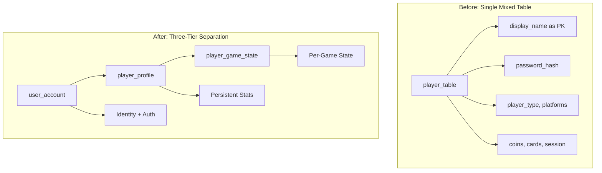

# Three-Tier Account Architecture Refactor

This refactor implements the proper platform architecture separating identity, profile, and game state into distinct tables.

## Architecture Change



## Three-Tier Model

### Tier 1: user_account (NEW TABLE - Identity + Auth)

Permanent account data that exists from registration until account deletion.

| Field | Type | Purpose |

|-------|------|---------|

| `user_id` | UUID | Primary key, immutable identifier |

| `user_name` | String UNIQUE | Login identifier |

| `display_name` | String UNIQUE | Public-facing name |

| `email` | String UNIQUE | Account recovery, notifications |

| `email_verified` | Boolean | Email confirmation status |

| `password_hash` | String | Authentication |

| `account_status` | Enum | active, suspended, banned, deactivated |

| `player_type` | Enum | human, llm_agent, admin |

| `game_privileges` | Array | Special permissions |

| `created_at` | Timestamp | Account creation time |

| `last_login_at` | Timestamp | Last successful login |

### Tier 2: player_profile (NEW TABLE - Persistent Stats)

Persistent game-related data that accumulates over time. One per user.

| Field | Type | Purpose |

|-------|------|---------|

| `user_id` | UUID FK/PK | Links to user_account (1:1) |

| `games_played` | Integer | Total games participated |

| `games_won` | Integer | Total victories |

| `games_lost` | Integer | Total defeats |

| `rank` | String/Integer | Matchmaking rank or ELO |

| `avatar_url` | String | Profile picture |

| `bio` | String | Self-description |

| `preferred_platform` | Enum | Discord, Slack, Web preference |

| `social_media_platforms` | Array | Linked platforms for loyalty |

| `achievements` | JSON | Unlocked achievements |

| `updated_at` | Timestamp | Last profile update |

### Tier 3: player_game_state (RENAMED from player_table)

Transient state that exists only during an active game session.

| Field | Type | Purpose |

|-------|------|---------|

| `id` | UUID | Primary key for this game state record |

| `user_id` | UUID FK | Links to user_account |

| `session_id` | UUID FK | Links to game_session |

| `coins` | Integer | Current coins in this game |

| `debt` | Integer | Current debt in this game |

| `card_types` | Array | Cards held in this game |

| `player_statuses` | Array | ALIVE, ELIMINATED, etc. |

| `target_display_name` | String | Current target selection (UI name) |

| `to_be_initiated` | Array | Pending actions |

| `joined_at` | Timestamp | When joined this session |

## Key Relationships

```
user_account (1) ─────── (1) player_profile
     │
     │ one-to-many (current + historical games)
     ▼
player_game_state ─────── game_session
     │
     └── upgrade_details, reactions (FK to player_game_state or user_id)
```

## Field Migration Map

| Current player_table Field | New Location |

|----------------------------|--------------|

| `display_name` (PK) | `user_account.display_name` |

| `password_hash` | `user_account.password_hash` |

| `player_type` | `user_account.player_type` |

| `game_privileges` | `user_account.game_privileges` |

| `social_media_platforms` | `player_profile.social_media_platforms` |

| `preferred_social_media_platform` | `player_profile.preferred_platform` |

| `social_media_platform_display_name` | `player_profile.platform_display_name` |

| `session_id` | `player_game_state.session_id` |

| `coins` | `player_game_state.coins` |

| `debt` | `player_game_state.debt` |

| `card_types` | `player_game_state.card_types` |

| `player_statuses` | `player_game_state.player_statuses` |

| `target_display_name` | `player_game_state.target_display_name` |

| `to_be_initiated` | `player_game_state.to_be_initiated` |

## New Fields

| Field | Table | Purpose |

|-------|-------|---------|

| `user_id` | user_account | UUID primary key |

| `user_name` | user_account | Login identifier |

| `email` | user_account | Account recovery |

| `email_verified` | user_account | Verification status |

| `account_status` | user_account | active/suspended/banned |

| `created_at` | user_account | Registration timestamp |

| `last_login_at` | user_account | Security tracking |

| `games_played` | player_profile | Stats |

| `games_won` | player_profile | Stats |

| `games_lost` | player_profile | Stats |

| `rank` | player_profile | Matchmaking |

| `avatar_url` | player_profile | Profile picture |

| `bio` | player_profile | Self-description |

## Phase 1: Database Schema Changes

### 1.1 Create user_account Table

```python
class UserAccount(db.Model):
    """User account - identity and authentication."""
    __bind_key__ = 'db_players'
    __tablename__ = 'user_account'
    
    user_id: Mapped[uuid.UUID] = mapped_column(UUID(as_uuid=True), primary_key=True, default=uuid.uuid4)
    user_name: Mapped[str] = mapped_column(String(50), unique=True, nullable=False, index=True)
    display_name: Mapped[str] = mapped_column(String(100), unique=True, nullable=False)
    email: Mapped[Optional[str]] = mapped_column(String(255), unique=True, nullable=True)
    email_verified: Mapped[bool] = mapped_column(default=False)
    password_hash: Mapped[Optional[str]] = mapped_column(String, nullable=True)
    account_status: Mapped[str] = mapped_column(String(20), default="active")
    player_type: Mapped[PlayerType] = mapped_column(...)
    game_privileges: Mapped[List[GamePrivilege]] = mapped_column(...)
    created_at: Mapped[datetime] = mapped_column(DateTime(timezone=True), default=now)
    last_login_at: Mapped[Optional[datetime]] = mapped_column(DateTime(timezone=True), nullable=True)
    
    # Relationships
    profile = relationship("PlayerProfile", back_populates="user", uselist=False)
    game_states = relationship("PlayerGameState", back_populates="user")
    oauth_identities = relationship("OAuthIdentity", back_populates="user")
```

### 1.2 Create player_profile Table

```python
class PlayerProfile(db.Model):
    """Player profile - persistent game stats and preferences."""
    __bind_key__ = 'db_players'
    __tablename__ = 'player_profile'
    
    user_id: Mapped[uuid.UUID] = mapped_column(ForeignKey("user_account.user_id"), primary_key=True)
    games_played: Mapped[int] = mapped_column(default=0)
    games_won: Mapped[int] = mapped_column(default=0)
    games_lost: Mapped[int] = mapped_column(default=0)
    rank: Mapped[Optional[str]] = mapped_column(String(50), nullable=True)
    avatar_url: Mapped[Optional[str]] = mapped_column(String(500), nullable=True)
    bio: Mapped[Optional[str]] = mapped_column(Text, nullable=True)
    preferred_platform: Mapped[Optional[SocialMediaPlatform]] = mapped_column(...)
    social_media_platforms: Mapped[List[SocialMediaPlatform]] = mapped_column(...)
    achievements: Mapped[Optional[dict]] = mapped_column(JSON, nullable=True)
    updated_at: Mapped[datetime] = mapped_column(DateTime(timezone=True), default=now, onupdate=now)
    
    # Relationships
    user = relationship("UserAccount", back_populates="profile")
```

### 1.3 Rename/Refactor player_table to player_game_state

```python
class PlayerGameState(db.Model):
    """Player game state - per-session transient state."""
    __bind_key__ = 'db_players'
    __tablename__ = 'player_game_state'  # Renamed from player_table_orm
    
    id: Mapped[uuid.UUID] = mapped_column(UUID(as_uuid=True), primary_key=True, default=uuid.uuid4)
    user_id: Mapped[uuid.UUID] = mapped_column(ForeignKey("user_account.user_id"), nullable=False, index=True)
    session_id: Mapped[Optional[str]] = mapped_column(ForeignKey("game_session_table_orm.session_id"), nullable=True)
    
    # Game state
    coins: Mapped[int] = mapped_column(default=2)
    debt: Mapped[int] = mapped_column(default=0)
    card_types: Mapped[List[CardType]] = mapped_column(...)
    player_statuses: Mapped[List[PlayerStatus]] = mapped_column(...)
    target_display_name: Mapped[Optional[str]] = mapped_column(String, nullable=True)
    to_be_initiated: Mapped[List[ToBeInitiated]] = mapped_column(...)
    
    joined_at: Mapped[datetime] = mapped_column(DateTime(timezone=True), default=now)
    
    # Relationships
    user = relationship("UserAccount", back_populates="game_states")
    upgrade_details = relationship("ToBeInitiatedUpgradeDetails", back_populates="game_state")
```

### 1.4 Child Tables - FK Changes

| Table | Current FK | New FK | Notes |

|-------|------------|--------|-------|

| `oauth_identity` | `player_display_name` | `user_id -> user_account.user_id` | Links to account, not game state |

| `account_flag` | `player_display_name` | `user_id -> user_account.user_id` | Links to account |

| `account_link_request` | `player_display_name` | `user_id -> user_account.user_id` | Links to account |

| `agent_profile` | `display_name` | `user_id -> user_account.user_id` | Links to account |

| `to_be_initiated_upgrade_details` | `display_name` | `game_state_id -> player_game_state.id` | Links to game state |

| `reaction` | `reactor/actor_display_name` | `reactor/actor_user_id -> user_account.user_id` | Links to accounts |

### 1.4 SQL Migration Script

Create [migrations/user_id_primary_key_migration.sql](game_server/backend/migrations/user_id_primary_key_migration.sql):

```sql
-- ============================================================
-- PHASE 1: Add new columns to player table
-- ============================================================
ALTER TABLE player_table_orm 
    ADD COLUMN user_id UUID DEFAULT gen_random_uuid(),
    ADD COLUMN user_name VARCHAR;

-- Populate user_name from display_name (initial data)
UPDATE player_table_orm SET user_name = display_name;

-- Make user_name NOT NULL after population
ALTER TABLE player_table_orm ALTER COLUMN user_name SET NOT NULL;

-- Add unique constraint on user_name
ALTER TABLE player_table_orm ADD CONSTRAINT uq_user_name UNIQUE (user_name);

-- ============================================================
-- PHASE 2: Add user_id columns to child tables
-- ============================================================
ALTER TABLE to_be_initiated_upgrade_details_table_orm ADD COLUMN user_id UUID;
ALTER TABLE oauth_identity ADD COLUMN user_id UUID;
ALTER TABLE account_flag ADD COLUMN user_id UUID;
ALTER TABLE account_link_request ADD COLUMN user_id UUID;
ALTER TABLE agent_profile_table_orm ADD COLUMN user_id UUID;
ALTER TABLE reaction_table_orm ADD COLUMN reactor_user_id UUID, ADD COLUMN actor_user_id UUID;

-- ============================================================
-- PHASE 3: Populate user_id in child tables from player join
-- ============================================================
UPDATE to_be_initiated_upgrade_details_table_orm u 
SET user_id = p.user_id 
FROM player_table_orm p WHERE u.display_name = p.display_name;

UPDATE oauth_identity o 
SET user_id = p.user_id 
FROM player_table_orm p WHERE o.player_display_name = p.display_name;

-- (similar for other tables...)

-- ============================================================
-- PHASE 4: Drop old FKs, add new FKs, change PKs
-- ============================================================
-- (detailed steps for each table)

-- ============================================================
-- PHASE 5: Drop old columns, set new PK
-- ============================================================
ALTER TABLE player_table_orm DROP CONSTRAINT player_table_orm_pkey;
ALTER TABLE player_table_orm ADD PRIMARY KEY (user_id);
```

## Phase 2: Backend Service Updates

### 2.1 CRUD Layer (NEW - 15 files)

**Design Principle: CRUD handles data access. Services handle business logic.**

All CRUD files go in `game_server/backend/app/crud/` with predictable interface:

```python
# Standard CRUD interface for each table
class TableNameCRUD:
    @staticmethod
    def get_by_id(id) -> Optional[Model]: ...
    
    @staticmethod
    def get_all(**filters) -> List[Model]: ...
    
    @staticmethod
    def create(**data) -> Model: ...
    
    @staticmethod
    def update(id, **data) -> Optional[Model]: ...
    
    @staticmethod
    def delete(id) -> bool: ...
    
    # Table-specific lookups as needed
    @staticmethod
    def get_by_unique_field(value) -> Optional[Model]: ...
```

| CRUD File | Table | Notes |
|-----------|-------|-------|
| `user_account_crud.py` | UserAccount | NEW table - get_by_user_name, get_by_email |
| `player_profile_crud.py` | PlayerProfile | NEW table - get_by_user_id |
| `player_game_state_crud.py` | PlayerGameState | Renamed - get_by_session, get_active_for_user |
| `account_flag_crud.py` | AccountFlag | |
| `account_link_request_crud.py` | AccountLinkRequest | |
| `agent_profile_crud.py` | AgentProfile | |
| `broadcast_destination_crud.py` | BroadcastDestination | |
| `chat_bot_endpoint_crud.py` | ChatBotEndpoint | |
| `chat_message_crud.py` | ChatMessage | get_by_session, get_recent |
| `game_server_log_crud.py` | GameServerLog | |
| `game_session_crud.py` | GameSession | get_active, get_by_status |
| `oauth_identity_crud.py` | OAuthIdentity | get_by_provider_user_id |
| `reaction_crud.py` | Reaction | get_by_session |
| `upgrade_details_crud.py` | ToBeInitiatedUpgradeDetails | |
| `turn_result_crud.py` | TurnResultORM | |

### 2.2 Services (Business Logic Only)

Services no longer do direct ORM queries. They call CRUD methods.

| Service | Purpose |
|---------|---------|
| `auth_service.py` | Authentication logic, JWT creation (uses user_account_crud) |
| `registration_service.py` | Account creation flow (uses user_account_crud + player_profile_crud) |
| `session_service.py` | Game session management (uses game_session_crud + player_game_state_crud) |
| `gameplay_service.py` | In-game actions (uses player_game_state_crud) |
| `stats_service.py` | Update win/loss stats (uses player_profile_crud) |

### 2.3 Service Update Strategy

| Context | Table | Field |

|---------|-------|-------|

| User registration | user_account | All identity fields |

| Authentication | user_account | user_name, password_hash |

| Login response | user_account + player_profile | Combined data |

| Join game session | player_game_state | Create new record |

| In-game actions | player_game_state | coins, cards, etc. |

| Game end stats | player_profile | Increment games_played/won |

| Display in chat | user_account | display_name |

| API responses | All three tables | Combined as needed |

### 2.3 Service Refactoring

| Service | Changes |

|---------|---------|

| `player_service.py` | Split into user_account_service + player_game_state operations |

| `auth_service.py` | Query user_account table, not player_table |

| `oauth_service.py` | Link to user_account.user_id |

| `session_service.py` | Create player_game_state when joining session |

| `reaction_service.py` | Store reactor_user_id, actor_user_id |

| `gameplay_service.py` | Query player_game_state for current game |

| `action_resolution_service.py` | Resolve display_name to user_id via user_account |

### 2.2 API Model Updates

**Login Request** - Change from `display_name` to `user_name`:

```python
login_request = api.model('LoginRequest', {
    'user_name': fields.String(required=True, description='Login username'),
    'password': fields.String(required=True, description='Password')
})
```

**Player Response** - Include all three identity fields:

```python
player_response = api.model('PlayerResponse', {
    'user_id': fields.String(description='Unique player ID (UUID)'),
    'user_name': fields.String(description='Login username'),
    'display_name': fields.String(description='Public display name'),
    # ... other fields
})
```

### 2.3 API Endpoint Updates

- [auth_ns.py](game_server/backend/app/apis/auth/auth_ns.py): Accept `user_name` for login
- [player_ns.py](game_server/backend/app/apis/players/player_ns.py): Support `/players/<user_name>` routes
- Profile URLs use `user_name` for human-readable paths

## Phase 3: Lang Graph Server Updates

### 3.1 Database Model

Update [lang_graph_server/app/database/models.py](lang_graph_server/app/database/models.py) to mirror player table:

```python
class Player(Base):
    __tablename__ = 'player_table_orm'
    
    user_id = Column(UUID, primary_key=True)
    user_name = Column(String, unique=True)
    display_name = Column(String, unique=True)
    target_display_name = Column(String, nullable=True)  # Keep as display_name
    # ...
```

### 3.2 Services

- Login uses `user_name`, internal lookups use `user_id`
- Profile cache keys use `user_id` (stable)

## Phase 4: Discord/Slack Bot Updates

### TokenCache Schema

Store all three identity fields from game server auth response:

```python
user_id: Mapped[str] = mapped_column(String(36), nullable=False)
user_name: Mapped[str] = mapped_column(String(100), nullable=False)
display_name: Mapped[str] = mapped_column(String(100), nullable=False)
```

## Phase 5: Frontend Updates

### Type Definitions

```typescript
// types/auth.ts
export const LoginRequestSchema = z.object({
  user_name: z.string().min(1, 'Username is required'),
  password: z.string().min(1, 'Password is required'),
});

// types/player.ts  
export const PlayerSchema = z.object({
  user_id: z.string().uuid(),
  user_name: z.string(),
  display_name: z.string(),
  // ...
});
```

### LoginForm

- Label: "Username"
- Field name in payload: `user_name`
- Store `user_id` in auth state after login

## Field Usage Summary

| Context | Field to Use |

|---------|--------------|

| Login form input | `user_name` |

| Database FKs | `user_id` |

| Profile URL | `/profile/{user_name}` |

| JWT subject claim | `user_id` |

| In-game chat sender | `display_name` |

| Target selection UI | `display_name` (shows names) |

| Target storage in DB | `target_display_name` (for UI) or resolve to `user_id` |

| API responses | All three fields |

## Execution Order

1. **Backup database**
2. **Create and test migration script** on copy of data
3. **Update ORM models** (all at once - they reference each other)
4. **Run migration** on database
5. **Update backend services** one by one
6. **Update API models and endpoints**
7. **Update lang_graph_server**
8. **Update discord_bot and slack_bot**
9. **Update frontend**
10. **Full integration test**

## Risk Mitigation

- Create database backup before migration
- Test migration on copy of production data first
- Keep old columns temporarily (can drop later after verification)
- Update in dependency order: models -> services -> APIs -> clients

---

## Complete File List

### Game Server Backend - ORM Models (9 files, 2 NEW)

| File | Status | Why |

|------|--------|-----|

| `game_server/backend/app/models/postgres_sql_db_models/user_account.py` | **NEW** | Create user_account model (identity + auth) |

| `game_server/backend/app/models/postgres_sql_db_models/player_profile.py` | **NEW** | Create player_profile model (persistent stats) |

| `game_server/backend/app/models/postgres_sql_db_models/player.py` | RENAME | Becomes `player_game_state.py` (per-session state) |

| `game_server/backend/app/models/postgres_sql_db_models/oauth_identity.py` | UPDATE | FK -> `user_account.user_id` |

| `game_server/backend/app/models/postgres_sql_db_models/account_flag.py` | UPDATE | FK -> `user_account.user_id` |

| `game_server/backend/app/models/postgres_sql_db_models/account_link_request.py` | UPDATE | FK -> `user_account.user_id` |

| `game_server/backend/app/models/postgres_sql_db_models/agent_profile.py` | UPDATE | FK -> `user_account.user_id` |

| `game_server/backend/app/models/postgres_sql_db_models/reaction.py` | UPDATE | FKs -> `reactor_user_id`, `actor_user_id` |

| `game_server/backend/app/models/postgres_sql_db_models/__init__.py` | UPDATE | Export new models |

### Game Server Backend - REST API Models (5 files, 1 NEW)

| File | Status | Why |

|------|--------|-----|

| `game_server/backend/app/models/rest_api_models/account_models.py` | UPDATE | Add user_account response models |

| `game_server/backend/app/models/rest_api_models/auth_models.py` | UPDATE | Login uses `user_name`, response includes all identity fields |

| `game_server/backend/app/models/rest_api_models/player_models.py` | UPDATE | Separate profile vs game_state models |

| `game_server/backend/app/models/rest_api_models/session_models.py` | UPDATE | Player references use new structure |

| `game_server/backend/app/models/rest_api_models/gameplay_models.py` | UPDATE | Action payloads reference user_id |

### Game Server Backend - CRUD Layer (15 files, ALL NEW)

**Location:** `game_server/backend/app/crud/`

| File | Table | Custom Methods |
|------|-------|----------------|
| `user_account_crud.py` | UserAccount | get_by_user_name, get_by_email |
| `player_profile_crud.py` | PlayerProfile | get_by_user_id |
| `player_game_state_crud.py` | PlayerGameState | get_by_session, get_active_for_user |
| `account_flag_crud.py` | AccountFlag | get_by_user_id |
| `account_link_request_crud.py` | AccountLinkRequest | get_pending_for_user |
| `agent_profile_crud.py` | AgentProfile | get_by_user_id |
| `broadcast_destination_crud.py` | BroadcastDestination | get_by_session |
| `chat_bot_endpoint_crud.py` | ChatBotEndpoint | get_active |
| `chat_message_crud.py` | ChatMessage | get_by_session, get_recent |
| `game_server_log_crud.py` | GameServerLog | get_recent, get_by_level |
| `game_session_crud.py` | GameSession | get_active, get_by_status |
| `oauth_identity_crud.py` | OAuthIdentity | get_by_provider_user_id |
| `reaction_crud.py` | Reaction | get_by_session, get_by_turn |
| `upgrade_details_crud.py` | ToBeInitiatedUpgradeDetails | get_by_game_state |
| `turn_result_crud.py` | TurnResultORM | get_by_session |

### Game Server Backend - Services (14 files, 0 NEW - refactor to use CRUD)

**Services now call CRUD layer instead of direct ORM queries.**

| File | Status | Changes |
|------|--------|---------|
| `player_service.py` | REFACTOR | Uses player_game_state_crud, removes direct queries |
| `auth_service.py` | REFACTOR | Uses user_account_crud.get_by_user_name for auth |
| `oauth_service.py` | REFACTOR | Uses oauth_identity_crud, user_account_crud |
| `session_service.py` | REFACTOR | Uses game_session_crud, player_game_state_crud |
| `reaction_service.py` | REFACTOR | Uses reaction_crud |
| `action_resolution_service.py` | REFACTOR | Uses player_game_state_crud, user_account_crud |
| `gameplay_service.py` | REFACTOR | Uses player_game_state_crud |
| `account_link_service.py` | REFACTOR | Uses account_link_request_crud |
| `account_flag_service.py` | REFACTOR | Uses account_flag_crud |
| `chat_service.py` | REFACTOR | Uses chat_message_crud |
| `chat_broadcast_service.py` | REFACTOR | Uses broadcast_destination_crud |
| `deck_service.py` | REFACTOR | Uses player_game_state_crud |
| `phase_transition_service.py` | REFACTOR | Uses game_session_crud, player_game_state_crud |
| `lang_graph_client.py` | UPDATE | Player data payloads include new fields |

### Game Server Backend - API Endpoints (8 files, 0 NEW)

**Design Principle: Routes are thin wrappers. All business logic lives in services.**

Routes should only:

1. Parse/validate request data
2. Call service method(s)
3. Return formatted response

| File | Status | Why |

|------|--------|-----|

| `game_server/backend/app/apis/auth/auth_ns.py` | UPDATE | Login accepts `user_name` instead of `display_name` |

| `game_server/backend/app/apis/auth/oauth_ns.py` | UPDATE | Returns all three identity fields in tokens |

| `game_server/backend/app/apis/players/player_ns.py` | UPDATE | Registration creates user_account + player_profile; add `/me/stats` endpoint |

| `game_server/backend/app/apis/admin/admin_player_ns.py` | UPDATE | Admin endpoints use user_id for lookups |

| `game_server/backend/app/apis/admin/admin_session_ns.py` | UPDATE | Session management uses user_id |

| `game_server/backend/app/apis/game/game_session_ns.py` | UPDATE | Session player data from player_game_state |

| `game_server/backend/app/apis/game/chat_ns.py` | UPDATE | Chat sender uses display_name from user_account |

| `game_server/backend/app/apis/account/identity_ns.py` | UPDATE | Query by user_id instead of player_display_name |

### Route Changes Detail

**`/auth/login` (auth_ns.py)**

- Before: `{ "display_name": "...", "password": "..." }`
- After: `{ "user_name": "...", "password": "..." }`
- Calls: `UserAccountService.authenticate()` → returns user_account
- Response adds: `user_id`, `user_name`, `display_name`

**`/players/register` (player_ns.py)**

- Before: Creates single player_table record
- After: Calls `UserAccountService.create_account()` + `PlayerProfileService.create_profile()`
- Request accepts: `user_name` (login), `display_name` (public), `email` (optional)

**`/players/me` (player_ns.py)**

- Before: Returns mixed player data
- After: Returns combined user_account + player_profile data
- Calls: `UserAccountService.get_by_id()`, `PlayerProfileService.get_by_user_id()`

**New endpoint: `/players/me/stats` (player_ns.py)**

- Returns: games_played, games_won, games_lost, rank from player_profile
- Calls: `PlayerProfileService.get_stats(user_id)`

**`/account-identities` (identity_ns.py)**

- Before: `filter_by(player_display_name=...)`
- After: `filter_by(user_id=...)`

### Game Server Backend - Migration (1 new file)

| File | Status | Why |

|------|--------|-----|

| `game_server/backend/migrations/three_tier_architecture_migration.sql` | **NEW** | Create tables, migrate data, drop old |

### Lang Graph Server (6 files)

| File | Status | Why |

|------|--------|-----|

| `lang_graph_server/app/database/models.py` | UPDATE | Add user_account, player_profile, player_game_state models |

| `lang_graph_server/app/services/pending_events_db_service.py` | UPDATE | Query with new table structure |

| `lang_graph_server/app/services/profile_sync_service.py` | UPDATE | Cache keys use user_id |

| `lang_graph_server/app/services/game_server_client.py` | UPDATE | Login payload uses user_name |

| `lang_graph_server/app/services/coup_event_service.py` | UPDATE | Player identity references |

| `lang_graph_server/app/agents/base_coup_agent.py` | UPDATE | Agent identity uses new fields |

### Discord Bot (4 files)

| File | Status | Why |

|------|--------|-----|

| `discord_bot/app/database/db_models.py` | UPDATE | TokenCache stores user_id, user_name, display_name |

| `discord_bot/app/services/token_cache_service.py` | UPDATE | Store/retrieve all three fields |

| `discord_bot/app/services/auth_service.py` | UPDATE | Parse JWT with new claims |

| `discord_bot/app/cogs/player_commands.py` | UPDATE | API payloads use new field names |

### Slack Bot (4 files)

| File | Status | Why |

|------|--------|-----|

| `slack_bot/app/database/db_models.py` | UPDATE | TokenCache stores user_id, user_name, display_name |

| `slack_bot/app/services/token_cache_service.py` | UPDATE | Store/retrieve all three fields |

| `slack_bot/app/services/auth_service.py` | UPDATE | Parse JWT with new claims |

| `slack_bot/app/listeners/game_chat.py` | UPDATE | Player identity in chat messages |

### Frontend (7 files, 1 NEW)

| File | Status | Why |

|------|--------|-----|

| `game_server/frontend/types/auth.ts` | UPDATE | LoginRequestSchema uses user_name |

| `game_server/frontend/types/player.ts` | UPDATE | Separate PlayerProfile and PlayerGameState types |

| `game_server/frontend/types/account.ts` | **NEW** | UserAccount type definitions |

| `game_server/frontend/components/auth/LoginForm.tsx` | UPDATE | Form sends user_name |

| `game_server/frontend/lib/api/auth.ts` | UPDATE | Login payload field name |

| `game_server/frontend/lib/api/players.ts` | UPDATE | Separate profile vs game state endpoints |

| `game_server/frontend/stores/authStore.ts` | UPDATE | Store user_id, user_name, display_name |

### Summary

| Category | Existing | New | Total |
|----------|----------|-----|-------|
| game_server/backend ORM models | 7 | 2 | 9 |
| game_server/backend CRUD layer | 0 | 15 | 15 |
| game_server/backend API models | 4 | 1 | 5 |
| game_server/backend services | 14 | 0 | 14 |
| game_server/backend endpoints | 8 | 0 | 8 |
| game_server/backend migrations | 0 | 1 | 1 |
| lang_graph_server | 6 | 0 | 6 |
| discord_bot | 4 | 0 | 4 |
| slack_bot | 4 | 0 | 4 |
| frontend | 6 | 1 | 7 |
| **Total** | **53** | **20** | **73 files** |

### Architecture Layers (Backend)

```
Routes (APIs)          <- Thin: parse request, call service, return response
    │
    ▼
Services               <- Business logic: validation, workflows, rules
    │
    ▼
CRUD Layer             <- Data access: get, create, update, delete
    │
    ▼
ORM Models             <- Schema: table definitions, relationships
    │
    ▼
Database               <- PostgreSQL
```