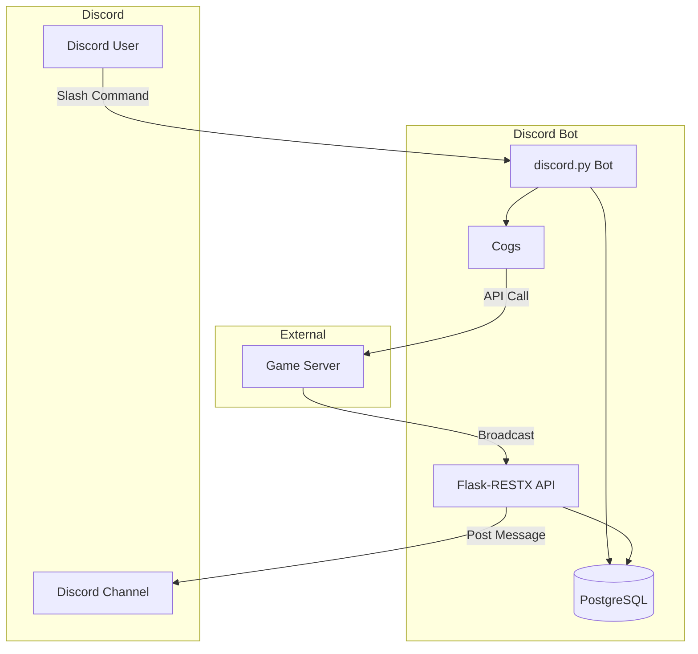

<p align="center">
  
</p>

<p align="center">
  
  
  
  
  <a href="https://github.com/psf/black"></a>
</p>

<p align="center">
  
</p>

<p align="center">
  <strong>Discord bot for the Coup card game with slash commands and game server integration.</strong>
</p>

---

> **Quick Start**
> ```bash
> cd discord_bot
> pip install -r requirements.txt
> python bot.py
> # Bot connects to Discord and Flask API runs on http://localhost:3001
> ```

---

## 📑 Table of Contents

- [📖 Overview](#-overview)
- [✨ Features](#-features)
- [🏗️ Architecture](#️-architecture)
- [⚡ Slash Commands](#-slash-commands)
- [🔌 API Endpoints](#-api-endpoints)
- [🧩 Cogs](#-cogs)
- [🛠️ Services](#️-services)
- [🚀 Setup](#-setup)
- [⚙️ Environment Variables](#️-environment-variables)
- [👨‍💻 Author](#-author)
- [📄 License](#-license)
- [🙏 Acknowledgments](#-acknowledgments)

---

## 📖 Overview

The **Discord Bot** serves as the Discord interface for the Coup card game. It connects Discord users to the game server, enabling them to:

- Join and manage game sessions via slash commands
- Chat in-game with messages forwarded to the game server
- Receive broadcasts from other platforms (Slack, etc.)
- Authenticate via Discord OAuth for seamless account linking

**Key Capabilities:**
- Hybrid slash/prefix commands via discord.py cogs
- Flask-RESTX API for receiving broadcasts and admin operations
- PostgreSQL logging and token caching
- Automatic slash command synchronization

---

## ✨ Features

### Bot Framework

| Feature | Status | Description |
|---------|--------|-------------|
| Hybrid Commands | ✅ | Both slash and prefix command support |
| Cog System | ✅ | Modular command organization |
| Auto-Sync Commands | ✅ | Register slash commands on startup |
| Orphan Command Cleanup | ✅ | Remove unused commands via API |

### Authentication

| Feature | Status | Description |
|---------|--------|-------------|
| OAuth Integration | ✅ | Discord OAuth via game server |
| Token Caching | ✅ | PostgreSQL-backed JWT cache per user |
| `@requires_linked_account` | ✅ | Decorator for auth-required commands |
| Admin Privilege Checks | ✅ | `@admin_only` decorator |

### Database & Infrastructure

| Feature | Status | Description |
|---------|--------|-------------|
| Auto-Create Tables | ✅ | SQLAlchemy creates tables on startup |
| PostgreSQL Logging | ✅ | Persistent command/message logging |
| Health/Readiness Checks | ✅ | `/health` and `/health/ready` endpoints |
| Graceful Shutdown | ✅ | Clean disconnect on SIGINT/SIGTERM |

### Flask-RESTX APIs

| Feature | Status | Description |
|---------|--------|-------------|
| Broadcast Endpoint | ✅ | Receive messages from game server |
| Command Management | ✅ | List, sync, delete slash commands |
| Swagger UI | ✅ | Interactive API docs at `/docs` |

---

## 🏗️ Architecture



### Folder Structure

```
discord_bot/
├── app/
│   ├── __init__.py              # Application factory
│   ├── constants.py             # Enums and constants
│   ├── extensions.py            # Flask extensions
│   ├── apis/                    # Flask-RESTX namespaces
│   │   ├── admin_ns.py          # Command management
│   │   ├── broadcast_ns.py      # Message broadcasting
│   │   └── health_ns.py         # Health checks
│   ├── bots/
│   │   └── discord_bot.py       # Bot class wrapper
│   ├── cogs/                    # Discord command modules
│   │   ├── admin_commands.py    # Game session commands
│   │   ├── game_chat.py         # Chat forwarding
│   │   └── owner.py             # Bot owner commands
│   ├── config/
│   │   └── logging_config.py    # Logging setup
│   ├── database/
│   │   └── db_models.py         # ORM models
│   ├── decorators/
│   │   └── auth.py              # Auth decorators
│   ├── lifecycle/               # Startup/shutdown
│   ├── models/                  # API models
│   └── services/                # Business logic
├── bot.py                       # Entry point
└── requirements.txt             # Dependencies
```

---

## ⚡ Slash Commands

### Game Session Commands

| Command | Description | Auth Required |
|---------|-------------|---------------|
| `/game_session-list` | List available game sessions | ✅ |
| `/game_session-create` | Create a new game session | ✅ Admin |
| `/game_session-join` | Join a game session | ✅ |
| `/game_session-leave` | Leave current session | ✅ |
| `/game_session-register-channel` | Register channel for broadcasts | ✅ Admin |

### Owner Commands

| Command | Description | Auth Required |
|---------|-------------|---------------|
| `/shutdown` | Gracefully shutdown the bot | Owner |
| `/load` | Load a cog | Owner |
| `/unload` | Unload a cog | Owner |
| `/reload` | Reload a cog | Owner |

---

## 🔌 API Endpoints

| Path | Method | Description |
|------|--------|-------------|
| `/health` | GET | Health check |
| `/health/ready` | GET | Readiness check |
| `/broadcast` | POST | Receive message from game server |
| `/admin/commands` | GET | List registered slash commands |
| `/admin/commands/local` | GET | List local command definitions |
| `/admin/commands/sync` | POST | Sync commands to Discord |
| `/admin/commands/<id>` | DELETE | Delete a slash command |
| `/admin/commands/orphaned` | GET | List orphaned commands |
| `/admin/commands/orphaned` | DELETE | Delete orphaned commands |

### Sample API Requests

<details>
<summary><strong>Broadcast: Send Message to Channel</strong></summary>

```bash
curl -X POST http://localhost:3001/broadcast \
  -H "Authorization: Bearer <jwt_token>" \
  -H "Content-Type: application/json" \
  -d '{
    "channel_id": "123456789",
    "message": "Game starting in 5 minutes!",
    "session_id": "sess_abc123"
  }'
```
</details>

<details>
<summary><strong>Admin: List Slash Commands</strong></summary>

```bash
curl -X GET "http://localhost:3001/admin/commands?guild_id=123456789" \
  -H "Authorization: Bearer <jwt_token>"
```
</details>

<details>
<summary><strong>Admin: Sync Commands</strong></summary>

```bash
curl -X POST "http://localhost:3001/admin/commands/sync?guild_id=123456789" \
  -H "Authorization: Bearer <jwt_token>"
```
</details>

<details>
<summary><strong>Health Check</strong></summary>

```bash
curl -X GET http://localhost:3001/health
```

**Response:**
```json
{
  "status": "healthy",
  "timestamp": "2024-12-28T12:00:00Z"
}
```
</details>

---

## 🧩 Cogs

| Cog | File | Description |
|-----|------|-------------|
| `AdminCommands` | `admin_commands.py` | Game session management slash commands |
| `GameChat` | `game_chat.py` | Forward messages to game server |
| `Owner` | `owner.py` | Bot owner commands (load/unload/reload) |

---

## 🛠️ Services

| Service | Responsibility |
|---------|----------------|
| `AuthService` | JWT token validation |
| `BroadcastService` | Post messages to Discord channels |
| `CommandRegistrationService` | Register commands with Discord API |
| `CommandSyncService` | Sync local commands with Discord |
| `HealthService` | Health and readiness checks |
| `LoggingService` | Database logging |
| `TokenCacheService` | PostgreSQL token cache |

---

## 🚀 Setup

### Prerequisites

- Python 3.12+
- PostgreSQL 15+
- Discord Bot Token (from [Discord Developer Portal](https://discord.com/developers/applications))

### Installation

```bash
# Navigate to discord_bot directory
cd discord_bot

# Create virtual environment
python -m venv venv
source venv/bin/activate  # Linux/Mac
# or: venv\Scripts\activate  # Windows

# Install dependencies
pip install -r requirements.txt
```

### Discord Bot Setup

1. Go to [Discord Developer Portal](https://discord.com/developers/applications)
2. Create a new application
3. Go to "Bot" section and create a bot
4. Copy the bot token
5. Enable required intents (Message Content, Server Members)
6. Go to OAuth2 → URL Generator
7. Select scopes: `bot`, `applications.commands`
8. Select permissions: Send Messages, Read Message History, etc.
9. Invite bot to your server using generated URL

### Running the Bot

```bash
# Set environment variables (or use .env file)
export DISCORD_TOKEN=your_bot_token
export DISCORD_BOT_DATABASE_URL=postgresql+psycopg://...

# Run the bot
python bot.py
```

---

## ⚙️ Environment Variables

| Variable | Required | Default | Description |
|----------|----------|---------|-------------|
| `DISCORD_TOKEN` | Yes | - | Discord bot token |
| `DISCORD_BOT_DATABASE_URL` | Yes | - | PostgreSQL connection string |
| `DISCORD_BOT_PORT` | No | `3001` | Flask API port |
| `GAME_SERVER_URL` | Yes | - | Game server URL |
| `JWT_SECRET_KEY` | Yes | - | Secret for JWT validation |
| `TEST_GUILD_ID` | No | - | Guild ID for command sync |
| `APPLICATION_ID` | Yes | - | Discord application ID |

---

## 👨‍💻 Author

**Laurent Mundell** - *By Any Means Developer*

<p>
  <a href="https://github.com/LaurentStar"></a>
  <a href="https://medium.com/@laurent.mundell"></a>
  <a href="https://www.hackerrank.com/profile/laurent_mundell"></a>
  <a href="http://www.linkedin.com/in/christian-mundell-90733555"></a>
</p>

> "I never surrender, even to impossible problems! I always find a way forward no matter how difficult the hunt."

---

## 📄 License

This project is licensed under the MIT License - see the [LICENSE](../LICENSE.md) file for details.

<p>
  
</p>

---

## 🙏 Acknowledgments

- [discord.py](https://discordpy.readthedocs.io/) - Discord API wrapper
- [Flask-RESTX](https://flask-restx.readthedocs.io/) - REST API framework
- [SQLAlchemy](https://www.sqlalchemy.org/) - Database ORM

---

<p align="center">
  Made with ❤️ for the Coup community
</p>

