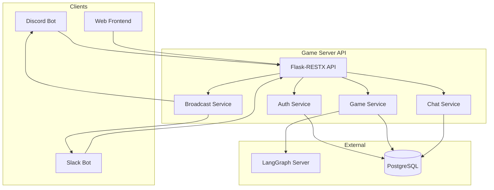
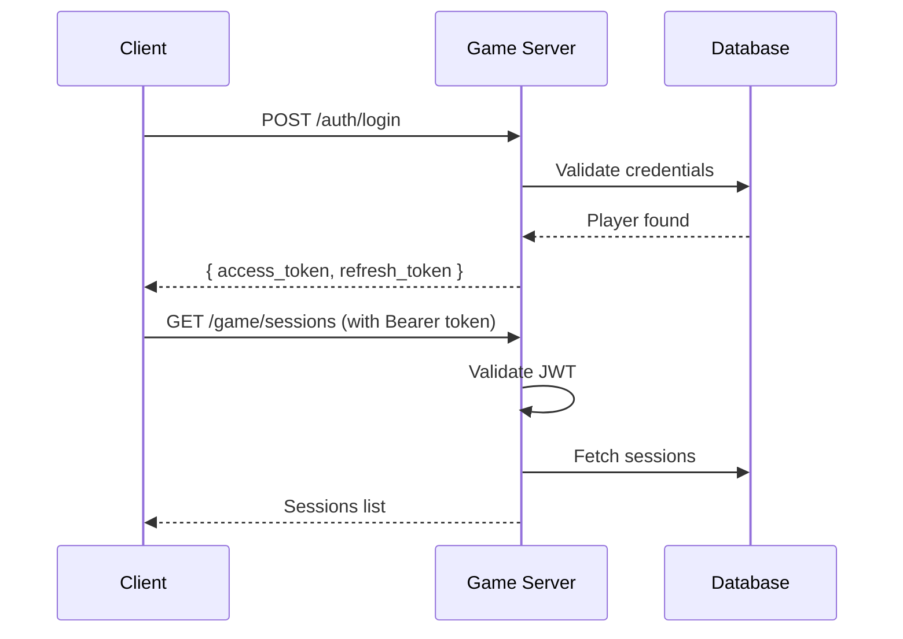

<p align="center">
  
</p>

<p align="center">
  
  
  
  
  <a href="https://github.com/psf/black"></a>
</p>

<p align="center">
  
</p>

<p align="center">
  <strong>Flask-RESTX API server for the Coup card game with multi-platform OAuth support.</strong>
</p>

---

> **Quick Start**
> ```bash
> cd game_server/backend
> pip install -r requirements.txt
> python app.py
> # Visit http://localhost:4000/docs for Swagger UI
> ```

---

## 📑 Table of Contents

- [📖 Overview](#-overview)
- [✨ Features](#-features)
- [🏗️ Architecture](#️-architecture)
- [🔌 API Namespaces](#-api-namespaces)
- [🗄️ Database Models](#️-database-models)
- [🛠️ Services](#️-services)
- [🔐 Authentication](#-authentication)
- [🚀 Setup](#-setup)
- [🐳 Docker](#-docker)
- [⚙️ Environment Variables](#️-environment-variables)
- [🗺️ Roadmap](#️-roadmap)
- [📚 API Documentation](#-api-documentation)
- [👨‍💻 Author](#-author)
- [📄 License](#-license)
- [🙏 Acknowledgments](#-acknowledgments)

---

## 📖 Overview

The **Coup Game Server** is the central API backend for a multiplayer implementation of the Coup card game. It orchestrates game sessions, player management, real-time chat, and integrates with LLM agents via LangGraph for AI opponents.

**Key Capabilities:**
- Host game sessions across multiple platforms (Discord, Slack)
- Authenticate players via OAuth (Discord, Google, Slack)
- Manage game state, actions, and turn resolution
- Broadcast messages across platforms
- Track platform loyalty for tribalism bonuses

---

## ✨ Features

### Authentication & Identity

| Feature | Status | Description |
|---------|--------|-------------|
| JWT Authentication | ✅ | Access + refresh tokens with configurable expiry |
| OAuth2 Login | ✅ | Discord, Slack, Google provider support |
| Email Auto-Matching | ✅ | Auto-link accounts with matching email addresses |
| Explicit Account Linking | ✅ | Email confirmation flow for manual linking |
| Token-by-Provider Endpoint | ✅ | Bots can lookup user JWT by OAuth ID |

### Platform Support

| Feature | Status | Description |
|---------|--------|-------------|
| Multi-Platform Play | ✅ | Discord and Slack bot integration |
| Platform Loyalty Tracking | ✅ | Track registered platforms for tribalism bonuses |
| Preferred Platform | ✅ | Players choose their "home" platform |
| Cross-Platform Broadcasting | ✅ | Messages broadcast to all connected platforms |

### Database & Infrastructure

| Feature | Status | Description |
|---------|--------|-------------|
| Auto-Create Tables | ✅ | SQLAlchemy creates tables on startup |
| PostgreSQL Support | ✅ | Production-ready database with multiple binds |
| Health/Readiness Checks | ✅ | `/health` and `/health/ready` endpoints |
| Local Slack Proxy | ✅ | Single ngrok tunnel for local development |
| Ngrok Auto-Start | ✅ | Tunnel starts automatically when `ENVIRONMENT=local` |

### Security & Admin

| Feature | Status | Description |
|---------|--------|-------------|
| OAuth Identity Soft-Delete | ✅ | 7-day grace period before permanent deletion |
| Account Flag System | ✅ | Internal flags for suspicious accounts |
| Admin Privilege Checks | ✅ | Admin-only endpoints with role verification |
| Similar Username Detection | ✅ | Auto-flag accounts with similar names |

### Game Logic

| Feature | Status | Description |
|---------|--------|-------------|
| Game Session Management | ✅ | Create, join, leave, end sessions |
| Coup Actions | ✅ | Income, Foreign Aid, Coup, Steal, Assassinate, etc. |
| Turn Resolution | ✅ | Challenge and block mechanics |
| LLM Agent Integration | ✅ | LangGraph server for AI opponents |

### Developer Experience

| Feature | Status | Description |
|---------|--------|-------------|
| Swagger UI | ✅ | Interactive API documentation at `/docs` |
| Flask-RESTX Pattern | ✅ | Organized namespaces and models |
| Comprehensive README | ✅ | Full documentation with examples |

### Coming Soon

| Feature | Status | Description |
|---------|--------|-------------|
| Docker Support | 🚧 | Containerization in progress |
| WebSocket Chat | 📋 | Real-time updates without polling |
| Tournament Mode | 📋 | Competitive play with brackets |
| Leaderboards | 📋 | Player rankings and statistics |

---

## 🏗️ Architecture



### Folder Structure

```
game_server/backend/
├── app/
│   ├── __init__.py              # Application factory
│   ├── constants.py             # Enums and constants
│   ├── extensions.py            # Flask extensions
│   ├── apis/                    # API namespaces
│   │   ├── account/             # Account management
│   │   ├── admin/               # Admin operations
│   │   ├── auth/                # Authentication
│   │   ├── game/                # Game logic
│   │   ├── local/               # Local dev proxy
│   │   ├── players/             # Player management
│   │   └── system/              # Health checks
│   ├── models/
│   │   ├── game_models/         # Game logic models
│   │   ├── postgres_sql_db_models/  # ORM models
│   │   └── rest_api_models/     # API request/response
│   ├── services/                # Business logic
│   ├── lifecycle/               # Startup/shutdown
│   ├── templates/               # HTML templates
│   └── static/                  # Static files
├── migrations/                  # SQL migrations
├── app.py                       # Entry point
├── requirements.txt             # Dependencies
└── README.md                    # This file
```

---

## 🔌 API Namespaces

| Domain | Path | Description |
|--------|------|-------------|
| Auth | `/auth` | Login, register, JWT tokens |
| OAuth | `/auth/oauth` | Discord, Google, Slack OAuth |
| Admin Sessions | `/admin/sessions` | Game session management |
| Admin Players | `/admin/players` | Player administration |
| Admin Flags | `/admin/flags` | Account flag review |
| Account Link | `/account/link` | Multi-identity linking |
| Account Identities | `/account/identities` | OAuth identity management |
| Game Sessions | `/game/sessions` | Session CRUD |
| Game Actions | `/game/actions` | Coup game actions |
| Game Chat | `/game/chat` | In-game messaging |
| Game Reactions | `/game/reactions` | Message reactions |
| Game State | `/game/state` | Game state queries |
| Players | `/players` | Player profiles |
| Health | `/health` | Health/readiness checks |
| Local Proxy | `/local/proxy/slack` | Slack proxy (local dev only) |

### Sample API Requests

<details>
<summary><strong>Auth: Login</strong></summary>

```bash
curl -X POST http://localhost:4000/auth/login \
  -H "Content-Type: application/json" \
  -d '{
    "username": "player1",
    "password": "secret123"
  }'
```

**Response:**
```json
{
  "access_token": "eyJhbGciOiJIUzI1NiIsInR5cCI6IkpXVCJ9...",
  "refresh_token": "eyJhbGciOiJIUzI1NiIsInR5cCI6IkpXVCJ9...",
  "player": {
    "display_name": "player1",
    "player_type": "human"
  }
}
```
</details>

<details>
<summary><strong>Auth: Register</strong></summary>

```bash
curl -X POST http://localhost:4000/auth/register \
  -H "Content-Type: application/json" \
  -d '{
    "username": "newplayer",
    "password": "mypassword123",
    "display_name": "NewPlayer"
  }'
```
</details>

<details>
<summary><strong>OAuth: Get Discord Login URL</strong></summary>

```bash
curl -X GET http://localhost:4000/auth/oauth/discord
```

**Response:** Redirects to Discord OAuth consent page.
</details>

<details>
<summary><strong>Game Sessions: Create</strong></summary>

```bash
curl -X POST http://localhost:4000/game/sessions \
  -H "Authorization: Bearer <access_token>" \
  -H "Content-Type: application/json" \
  -d '{
    "session_name": "Friday Night Coup",
    "max_players": 6
  }'
```

**Response:**
```json
{
  "session_id": "sess_abc123",
  "session_name": "Friday Night Coup",
  "status": "waiting",
  "players": [],
  "max_players": 6
}
```
</details>

<details>
<summary><strong>Game Sessions: List</strong></summary>

```bash
curl -X GET http://localhost:4000/game/sessions \
  -H "Authorization: Bearer <access_token>"
```
</details>

<details>
<summary><strong>Game Actions: Take Income</strong></summary>

```bash
curl -X POST http://localhost:4000/game/actions/income \
  -H "Authorization: Bearer <access_token>" \
  -H "Content-Type: application/json" \
  -d '{
    "session_id": "sess_abc123"
  }'
```
</details>

<details>
<summary><strong>Game Actions: Coup</strong></summary>

```bash
curl -X POST http://localhost:4000/game/actions/coup \
  -H "Authorization: Bearer <access_token>" \
  -H "Content-Type: application/json" \
  -d '{
    "session_id": "sess_abc123",
    "target_player": "opponent1"
  }'
```
</details>

<details>
<summary><strong>Health Check</strong></summary>

```bash
curl -X GET http://localhost:4000/health
```

**Response:**
```json
{
  "status": "healthy",
  "timestamp": "2024-12-28T12:00:00Z"
}
```
</details>

<details>
<summary><strong>Readiness Check</strong></summary>

```bash
curl -X GET http://localhost:4000/health/ready
```

**Response:**
```json
{
  "status": "ready",
  "checks": {
    "database": "ok",
    "services": "ok"
  }
}
```
</details>

---

## 🗄️ Database Models

| Model | Table | Description |
|-------|-------|-------------|
| `Player` | `player_table_orm` | Player identity, auth, game state |
| `GameSession` | `game_session_table_orm` | Game session configuration |
| `OAuthIdentity` | `oauth_identity` | Linked OAuth provider accounts |
| `AccountLinkRequest` | `account_link_request` | Pending account link requests |
| `AccountFlag` | `account_flag` | Internal flags for review |
| `ChatMessage` | `chat_message` | In-game chat messages |
| `Reaction` | `reaction` | Message reactions |
| `AgentProfile` | `agent_profile` | LLM agent configurations |
| `BroadcastDestination` | `broadcast_destination` | Platform broadcast targets |
| `ChatBotEndpoint` | `chat_bot_endpoint` | Bot API endpoints |

---

## 🛠️ Services

| Service | Responsibility |
|---------|----------------|
| `AuthService` | JWT token creation, validation, password hashing |
| `OAuthService` | Discord, Google, Slack OAuth flows |
| `PlayerService` | Player CRUD operations |
| `SessionService` | Game session management |
| `GameplayService` | Game action execution |
| `ActionResolutionService` | Turn resolution logic |
| `DeckService` | Card deck management |
| `PhaseTransitionService` | Game phase state machine |
| `ChatService` | In-game messaging |
| `ChatBroadcastService` | Cross-platform broadcasting |
| `ChatRoutingService` | Message routing to bots |
| `BroadcastService` | Platform message delivery |
| `ReactionService` | Message reaction handling |
| `AccountLinkService` | Multi-identity linking |
| `AccountFlagService` | Suspicious account flagging |
| `LangGraphClient` | LLM agent communication |

---

## 🔐 Authentication

### JWT Token Flow



### OAuth2 Flow (Discord/Slack/Google)

1. User clicks "Login with Discord/Slack/Google"
2. Redirected to provider's consent page
3. Provider redirects back with authorization code
4. Server exchanges code for access token
5. Server fetches user info from provider
6. Player created or linked (email auto-match)
7. JWT tokens issued to client

### Token Types

| Token | Expiry | Purpose |
|-------|--------|---------|
| Access Token | 24 hours | API authentication |
| Refresh Token | 7 days | Obtain new access token |

---

## 🚀 Setup

> **Note:** This section covers local development setup.
> Docker deployment instructions coming soon.

### Prerequisites

- Python 3.12+
- PostgreSQL 15+
- Virtual environment (recommended)

### Installation

```bash
# Clone the repository
git clone https://github.com/LaurentStar/Agentic-RAG-Langraph-ChatBot-Mastermind--ARLCAM.git
cd Agentic-RAG-Langraph-ChatBot-Mastermind--ARLCAM/game_server/backend

# Create virtual environment
python -m venv venv
source venv/bin/activate  # Linux/Mac
# or: venv\Scripts\activate  # Windows

# Install dependencies
pip install -r requirements.txt

# For local development (includes pyngrok, pytest, etc.)
pip install -r requirements-local.txt
```

### Database Setup

```bash
# Start PostgreSQL (Docker)
docker run -d \
  --name coup-postgres \
  -e POSTGRES_PASSWORD=mysecretpassword \
  -p 5432:5432 \
  postgres:15

# Tables are auto-created on first run via SQLAlchemy
```

### Running the Server

```bash
# Set environment variables (or use .env file)
export ENVIRONMENT=local
export GAME_SERVER_PORT=4000

# Run the server
python app.py
```

<!-- TODO: Update after Dockerization -->

---

## 🐳 Docker

> 🚧 **Coming Soon**
>
> Docker and docker-compose configuration is in progress.

```bash
# Future usage (placeholder)
docker compose up -d --build
```

---

## ⚙️ Environment Variables

| Variable | Required | Default | Description |
|----------|----------|---------|-------------|
| `ENVIRONMENT` | No | `local` | Environment: local, dev, qa, prod |
| `GAME_SERVER_PORT` | No | `4000` | Server port |
| `DATABASE_URL` | Yes | - | PostgreSQL connection string |
| `JWT_SECRET_KEY` | Yes | - | Secret for JWT signing |
| `DISCORD_CLIENT_ID` | For OAuth | - | Discord OAuth client ID |
| `DISCORD_CLIENT_SECRET` | For OAuth | - | Discord OAuth client secret |
| `DISCORD_REDIRECT_URI` | For OAuth | - | Discord OAuth callback URL |
| `SLACK_CLIENT_ID` | For OAuth | - | Slack OAuth client ID |
| `SLACK_CLIENT_SECRET` | For OAuth | - | Slack OAuth client secret |
| `SLACK_REDIRECT_URI` | For OAuth | - | Slack OAuth callback URL |
| `GOOGLE_CLIENT_ID` | For OAuth | - | Google OAuth client ID |
| `GOOGLE_CLIENT_SECRET` | For OAuth | - | Google OAuth client secret |
| `GOOGLE_REDIRECT_URI` | For OAuth | - | Google OAuth callback URL |
| `SLACK_BOT_LOCAL_URL` | Local only | `http://localhost:3002` | Slack bot URL for proxy |
| `NGROK_AUTH_TOKEN` | Local only | - | Ngrok authentication token |
| `NGROK_DEV_DOMAIN` | Local only | - | Ngrok static domain |

---

## 🗺️ Roadmap

| Feature | Status | Notes |
|---------|--------|-------|
| Core Game Logic | ✅ Complete | Actions, turns, phases |
| JWT Authentication | ✅ Complete | Access + refresh tokens |
| OAuth Integration | ✅ Complete | Discord, Slack, Google |
| Multi-Identity Linking | ✅ Complete | Email auto-match + explicit |
| Platform Loyalty | ✅ Complete | Tribalism tracking |
| Admin Flag System | ✅ Complete | Internal review |
| LangGraph Integration | ✅ Complete | LLM agent support |
| Swagger Documentation | ✅ Complete | Interactive API docs |
| Docker Support | 🚧 In Progress | Containerization |
| WebSocket Chat | 📋 Planned | Real-time updates |
| Tournament Mode | 📋 Planned | Competitive play |
| Leaderboards | 📋 Planned | Player rankings |

---

## 📚 API Documentation

Access the interactive Swagger UI at:

```
http://localhost:4000/docs
```


*Screenshot placeholder - add swagger-screenshot.png to readme_presentation folder*

---

## 👨‍💻 Author

**Laurent Mundell** - *By Any Means Developer*

<p>
  <a href="https://github.com/LaurentStar"></a>
  <a href="https://medium.com/@laurent.mundell"></a>
  <a href="https://www.hackerrank.com/profile/laurent_mundell"></a>
  <a href="http://www.linkedin.com/in/christian-mundell-90733555"></a>
</p>

> "I never surrender, even to impossible problems! I always find a way forward no matter how difficult the hunt."

---

## 📄 License

This project is licensed under the MIT License - see the [LICENSE](../../LICENSE.md) file for details.

<p>
  
</p>

---

## 🙏 Acknowledgments

- [Flask-RESTX](https://flask-restx.readthedocs.io/) - REST API framework
- [LangGraph](https://langchain-ai.github.io/langgraph/) - LLM agent orchestration
- [SQLAlchemy](https://www.sqlalchemy.org/) - Database ORM
- [Coup Board Game](https://boardgamegeek.com/boardgame/131357/coup) - Game inspiration
- [Discord.py](https://discordpy.readthedocs.io/) - Discord bot framework
- [Slack Bolt](https://slack.dev/bolt-python/) - Slack bot framework

---

<p align="center">
  Made with ❤️ for the Coup community
</p>

