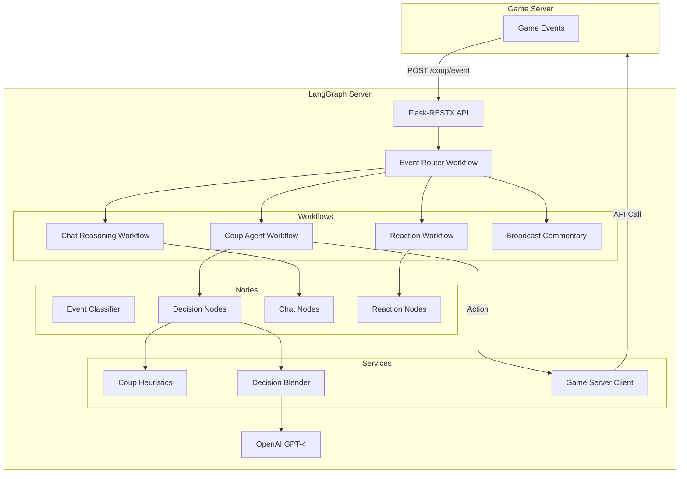
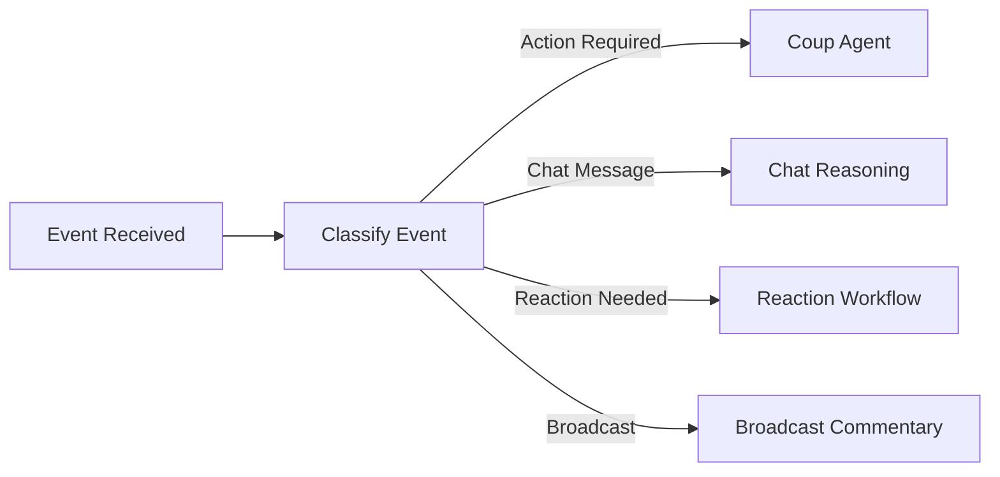
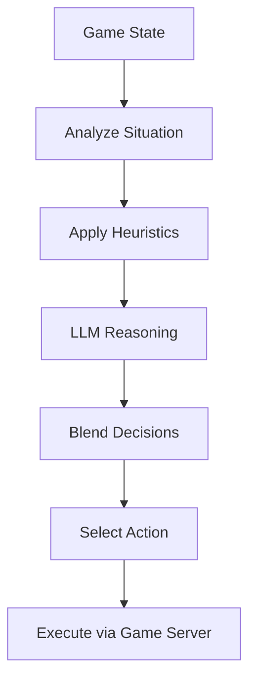
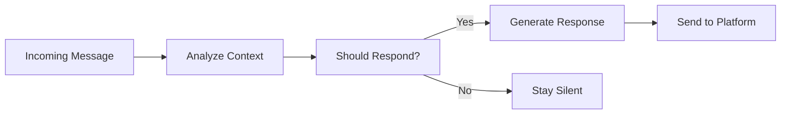
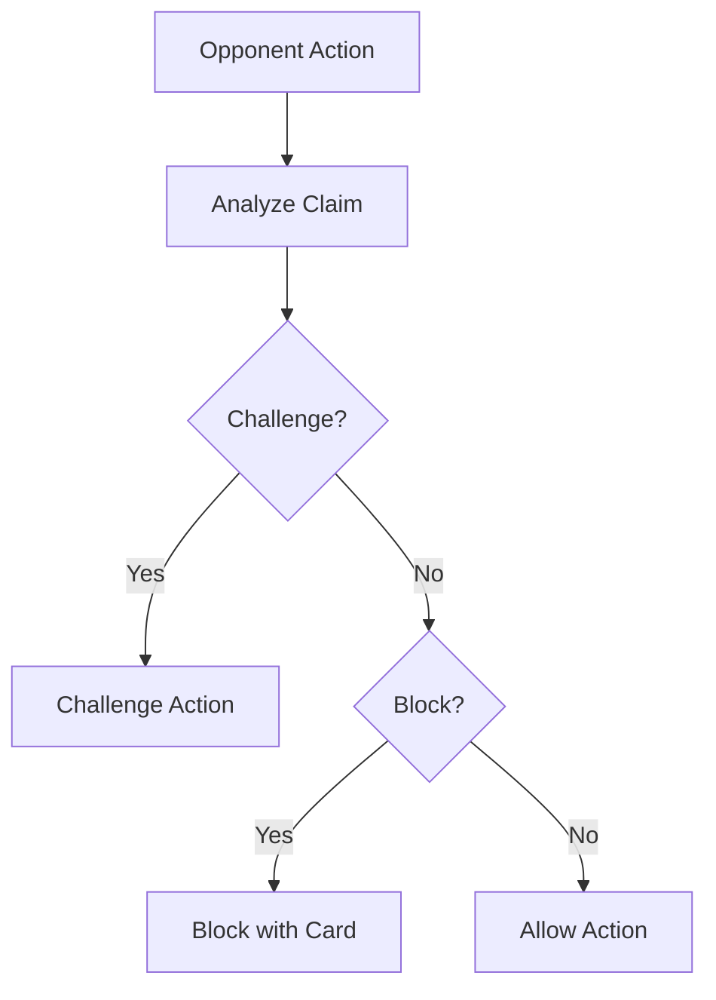

<p align="center">
  
</p>

<p align="center">
  
  
  
  
  <a href="https://github.com/psf/black"></a>
</p>

<p align="center">
  
</p>

<p align="center">
  <strong>LLM agent orchestration server for AI opponents in the Coup card game.</strong>
</p>

---

> **Quick Start**
> ```bash
> cd lang_graph_server
> pip install -r requirements.txt
> python main.py
> # LangGraph server runs on http://localhost:5000
> ```

---

## 📑 Table of Contents

- [📖 Overview](#-overview)
- [✨ Features](#-features)
- [🏗️ Architecture](#️-architecture)
- [🔄 Workflows](#-workflows)
- [🤖 Agents](#-agents)
- [🔌 API Endpoints](#-api-endpoints)
- [🛠️ Services](#️-services)
- [💬 Prompts](#-prompts)
- [🚀 Setup](#-setup)
- [⚙️ Environment Variables](#️-environment-variables)
- [🧪 Testing](#-testing)
- [👨‍💻 Author](#-author)
- [📄 License](#-license)
- [🙏 Acknowledgments](#-acknowledgments)

---

## 📖 Overview

The **LangGraph Server** is the AI brain of the Coup card game. It orchestrates LLM agents that play as opponents, making strategic decisions about:

- Which actions to take (Income, Coup, Steal, Assassinate, etc.)
- Whether to bluff about having certain cards
- Whether to challenge other players' claims
- Whether to block actions with their cards
- How to respond to chat messages

**Key Capabilities:**
- LangGraph workflow orchestration for complex decision trees
- Blended decision-making (heuristics + LLM reasoning)
- Multiple agent personalities via agent registry
- Event-driven architecture for game state changes
- Markdown prompt templates for LLM instructions

---

## ✨ Features

### LLM Integration

| Feature | Status | Description |
|---------|--------|-------------|
| LangGraph Workflows | ✅ | State machine-based agent logic |
| LangChain Integration | ✅ | LLM chain composition |
| OpenAI GPT-4 | ✅ | Primary reasoning model |
| Structured Outputs | ✅ | Type-safe LLM responses |

### Agent System

| Feature | Status | Description |
|---------|--------|-------------|
| Agent Registry | ✅ | Register multiple agent personalities |
| Base Coup Agent | ✅ | Abstract base class for agents |
| Profile Sync | ✅ | Sync agent profiles with game server |
| Decision Blending | ✅ | Combine heuristics with LLM reasoning |

### Workflows

| Feature | Status | Description |
|---------|--------|-------------|
| Event Router | ✅ | Route game events to correct handler |
| Coup Agent Workflow | ✅ | Main action decision flow |
| Chat Reasoning | ✅ | Generate chat responses |
| Broadcast Commentary | ✅ | Comment on game broadcasts |
| Reaction Workflow | ✅ | Decide challenges/blocks |

### Infrastructure

| Feature | Status | Description |
|---------|--------|-------------|
| Flask-RESTX API | ✅ | REST endpoints for game server |
| Checkpointer | ✅ | Persist workflow state |
| Heuristics Engine | ✅ | Rule-based decision support |
| Platform Router | ✅ | Route responses to correct platform |

---

## 🏗️ Architecture



### Folder Structure

```
lang_graph_server/
├── app/
│   ├── __init__.py              # Application factory
│   ├── constants.py             # Enums and constants
│   ├── extensions.py            # Flask extensions
│   ├── agents/                  # Agent definitions
│   │   ├── agent_registry.py    # Register agent personalities
│   │   └── base_coup_agent.py   # Abstract base agent
│   ├── apis/                    # Flask-RESTX namespaces
│   │   ├── coup_event_ns.py     # Game event handler
│   │   └── notifications/       # System notifications
│   ├── chains/                  # LangChain chains
│   │   └── coup_reasoning.py    # Reasoning chain
│   ├── graphs/                  # LangGraph workflows
│   │   ├── lang_graph_app.py    # Main graph app
│   │   └── workflows/           # Individual workflows
│   ├── models/                  # Data models
│   │   ├── config_models/       # Configuration
│   │   ├── decision_models/     # Decision outputs
│   │   ├── graph_state_models/  # Workflow states
│   │   ├── rest_api_models/     # API models
│   │   └── structured_output_models/  # LLM outputs
│   ├── nodes/                   # Workflow node functions
│   │   └── coup_agent/          # Agent-specific nodes
│   ├── prompts/                 # LLM prompt templates
│   ├── services/                # Business logic
│   └── utils/                   # Utilities
├── main.py                      # Entry point
├── requirements.txt             # Dependencies
└── test/                        # Test suite
```

---

## 🔄 Workflows

### Event Router Workflow

Routes incoming game events to the appropriate handler.



### Coup Agent Workflow

Main decision-making flow for game actions.



### Chat Reasoning Workflow

Generates chat responses based on game context.



### Reaction Workflow

Decides whether to challenge or block other players.



---

## 🤖 Agents

### Base Coup Agent

Abstract base class that all agents inherit from:

```python
class BaseCoupAgent:
    def decide_action(self, game_state) -> Action
    def decide_reaction(self, action, game_state) -> Reaction
    def generate_chat(self, message, game_state) -> Optional[str]
```

### Agent Registry

Register multiple agent personalities:

| Agent ID | Personality | Play Style |
|----------|-------------|------------|
| `aggressive_agent` | Aggressive | Bluffs often, challenges frequently |
| `conservative_agent` | Conservative | Plays safe, only bluffs when necessary |
| `chaotic_agent` | Unpredictable | Random decisions to confuse opponents |
| `analytical_agent` | Analytical | Calculates probabilities carefully |

---

## 🔌 API Endpoints

| Path | Method | Description |
|------|--------|-------------|
| `/coup/event` | POST | Receive game events for processing |
| `/notifications/system/infrastructure` | POST | Infrastructure notifications |

### Sample API Requests

<details>
<summary><strong>Coup Event: Action Required</strong></summary>

```bash
curl -X POST http://localhost:5000/coup/event \
  -H "Content-Type: application/json" \
  -d '{
    "event_type": "action_required",
    "agent_id": "aggressive_agent",
    "session_id": "sess_abc123",
    "game_state": {
      "current_player": "AI_Agent_1",
      "players": [...],
      "deck_size": 10
    }
  }'
```

**Response:**
```json
{
  "action": "steal",
  "target": "player2",
  "bluff": false,
  "reasoning": "Player2 has 5 coins, stealing prevents coup"
}
```
</details>

<details>
<summary><strong>Coup Event: Chat Message</strong></summary>

```bash
curl -X POST http://localhost:5000/coup/event \
  -H "Content-Type: application/json" \
  -d '{
    "event_type": "chat_message",
    "agent_id": "chaotic_agent",
    "session_id": "sess_abc123",
    "message": {
      "sender": "player1",
      "content": "I know you're bluffing!"
    }
  }'
```

**Response:**
```json
{
  "should_respond": true,
  "response": "Maybe I am, maybe I'm not. 😏",
  "platform": "discord"
}
```
</details>

<details>
<summary><strong>Coup Event: Reaction Needed</strong></summary>

```bash
curl -X POST http://localhost:5000/coup/event \
  -H "Content-Type: application/json" \
  -d '{
    "event_type": "reaction_required",
    "agent_id": "analytical_agent",
    "session_id": "sess_abc123",
    "action": {
      "type": "assassinate",
      "actor": "player1",
      "target": "AI_Agent_1",
      "claimed_card": "assassin"
    }
  }'
```

**Response:**
```json
{
  "reaction": "block",
  "card": "contessa",
  "bluff": true,
  "reasoning": "60% chance player1 doesn't have Assassin"
}
```
</details>

---

## 🛠️ Services

| Service | Responsibility |
|---------|----------------|
| `CoupEventService` | Process incoming game events |
| `CoupHeuristics` | Rule-based decision support |
| `DecisionBlenderService` | Combine heuristics + LLM decisions |
| `GameServerClient` | API calls to game server |
| `ChatService` | Chat message handling |
| `PlatformResponseRouter` | Route responses to correct platform |
| `CheckpointerFactory` | Create workflow checkpointers |
| `ProfileSyncService` | Sync agent profiles |
| `MessageCounterService` | Track message rates |
| `PendingEventsDBService` | Queue pending events |
| `InfrastructureService` | Health and system checks |
| `UpgradeDecisionService` | Card upgrade decisions |
| `ConditionalReactionService` | Conditional reaction logic |

---

## 💬 Prompts

Markdown templates for LLM instructions:

| Prompt | File | Purpose |
|--------|------|---------|
| Chat Analysis | `chat_message_analysis.md` | Analyze incoming chat messages |
| Response Generation | `chat_response_generation.md` | Generate chat responses |
| Action Selection | `coup_action_selection.md` | Choose game actions |
| Bluff Reasoning | `coup_bluff_reasoning.md` | Decide whether to bluff |
| Reaction Decision | `coup_reaction_decision.md` | Challenge/block decisions |

---

## 🚀 Setup

### Prerequisites

- Python 3.12+
- OpenAI API Key
- Game Server running

### Installation

```bash
# Navigate to lang_graph_server directory
cd lang_graph_server

# Create virtual environment
python -m venv venv
source venv/bin/activate  # Linux/Mac
# or: venv\Scripts\activate  # Windows

# Install dependencies
pip install -r requirements.txt
```

### Running the Server

```bash
# Set environment variables
export OPENAI_API_KEY=sk-your-key
export GAME_SERVER_URL=http://localhost:4000

# Run the server
python main.py
```

---

## ⚙️ Environment Variables

| Variable | Required | Default | Description |
|----------|----------|---------|-------------|
| `OPENAI_API_KEY` | Yes | - | OpenAI API key |
| `GAME_SERVER_URL` | Yes | - | Game server URL |
| `LANGGRAPH_PORT` | No | `5000` | Server port |
| `LLM_MODEL` | No | `gpt-4` | OpenAI model to use |
| `LLM_TEMPERATURE` | No | `0.7` | LLM temperature |
| `DATABASE_URL` | No | - | PostgreSQL for checkpointing |

---

## 🧪 Testing

```bash
# Run all tests
pytest

# Run with coverage
pytest --cov=app

# Run specific test file
pytest test/test_coup_event_endpoints.py
```

---

## 👨‍💻 Author

**Laurent Mundell** - *By Any Means Developer*

<p>
  <a href="https://github.com/LaurentStar"></a>
  <a href="https://medium.com/@laurent.mundell"></a>
  <a href="https://www.hackerrank.com/profile/laurent_mundell"></a>
  <a href="http://www.linkedin.com/in/christian-mundell-90733555"></a>
</p>

> "I never surrender, even to impossible problems! I always find a way forward no matter how difficult the hunt."

---

## 📄 License

This project is licensed under the MIT License - see the [LICENSE](../LICENSE.md) file for details.

<p>
  
</p>

---

## 🙏 Acknowledgments

- [LangGraph](https://langchain-ai.github.io/langgraph/) - Workflow orchestration
- [LangChain](https://www.langchain.com/) - LLM framework
- [OpenAI](https://openai.com/) - GPT-4 model
- [Flask-RESTX](https://flask-restx.readthedocs.io/) - REST API framework
- [Coup Board Game](https://boardgamegeek.com/boardgame/131357/coup) - Game inspiration

---

<p align="center">
  Made with ❤️ for the Coup community
</p>

